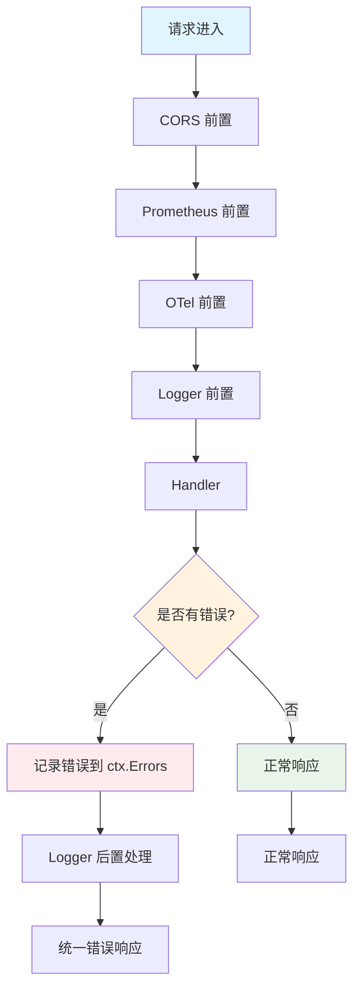

# BFF 中间件错误处理
## `Gin`标准的错误处理

如果某个中间件发生错误，为了正常退出，并给出必要的响应，需要三步：
1. 手动写响应。
2. 调用`ctx.Abort()`，阻止后续中间件或`handler`执行。
3. 手动`return`，阻断该中间件后续代码执行。

有多种方式:
### 1. 最基础`Abort()` + `JSON()`

```go
func AuthMiddleware() gin.HandlerFunc {
	return func(c *gin.Context) {
		token := c.GetHeader("Authorization")
		if token == "" {
			// 1. 手动写入响应体和状态码
			c.JSON(http.StatusUnauthorized, gin.H{
				"code": 401,
				"msg":  "缺少 Token，请先登录",
			})
			// 2. 阻断后续路由的执行
			c.Abort()
			// 3. 直接返回，终止当前函数
			return 
		}
		c.Next()
	}
}
```

### 2. 语法糖 `AbortWithStatusJSON`

`Gin` 提供了一系列 `AbortWith...` 的快捷方法，把“写响应”和“阻断”合并成了一步，代码更简洁。
```go
func AuthMiddleware() gin.HandlerFunc {
	return func(c *gin.Context) {
		if !checkPermission(c) {
			// 一步到位：阻断请求并返回 403 JSON 响应
			c.AbortWithStatusJSON(http.StatusForbidden, gin.H{
				"error": "权限不足，拒绝访问",
			})
			return // 依然需要 return！
		}
		c.Next()
	}
}
```
**其他同类的语法糖：**
- `c.AbortWithStatus(code)`：只阻断并返回状态码，不带响应体。
- `c.AbortWithError(code, err)`：阻断、返回状态码，并将 err 附加到 context 中，供后续统一日志处理。
### 3. 错误收集和集中处理

**核心逻辑**：使用最外层的**全局错误中间件**来统一格式输出。
```go
func ErrorHandlerMiddleware() gin.HandlerFunc {
	return func(c *gin.Context) {
		c.Next() // 先执行后续所有逻辑

		// 等后续逻辑执行完（或被 Abort）后，检查是否收集到了错误
		if len(c.Errors) > 0 {
			// 获取最后一个错误（或者遍历处理）
			err := c.Errors.Last()
			
			// 统一格式化响应
			c.JSON(c.Writer.Status(), gin.H{
				"success": false,
				"message": err.Error(),
			})
		}
	}
}
```

## 此项目的错误处理

### 错误流转过程
请求在中间件和`handler`中的流转：
```
请求进入
  │
  ├─ CORS 前置        (处理 OPTIONS，不合规直接返回)
  ├─ Prometheus 前置   (记录开始时间)
  ├─ OTel 前置         (生成 trace_id 注入 context)
  ├─ Logger 前置       (ctx.Next() → 等所有后续逻辑执行完)
  │    └─ Logger 后置  (统一读取 ctx.Errors，输出 JSON 响应) 
  ├─ OTel Attribute 后置 (补充 span 属性、写 trace_id 到 header)
  │
  └─ Handler (Wrap* → 业务函数)
```

`Wrap*`等函数包裹`handler`，并检查是否有前置的错误。如果有，直接`return`。
各部分都使用`ctx.Error()`来记录错误。

```go
// WrapReq 。用于处理有请求体的请求
// ctx表示上下文,req表示请求结构体,Resp表示响应结构体(这里全部填web.Response)
func WrapReq[Req any, Resp any](fn func(*gin.Context, Req) (Resp, error)) gin.HandlerFunc {
	return func(ctx *gin.Context) {
		//检查前置中间件是否存在错误,如果存在应当直接返回
		if len(ctx.Errors) > 0 {
			return
		}
		//解析参数
		var req Req
		err := bind(ctx, &req)
		if err != nil {
			ctx.Error(err)
			return
		}

		// 调用业务逻辑函数
		res, err := fn(ctx, req)
		if err != nil {
			ctx.Error(err) 
			return
		} else {
			ctx.Set(RESP_CTX, res)
		}
	}
}
```

### 链路中的错误处理
在链路中的错误，都会被`Logger`中间件捕获并集中处理。
**职责不清**，没有剥离全局错误处理中间件。
```go
func (lm *LoggerMiddleware) MiddlewareFunc() gin.HandlerFunc {
	return func(ctx *gin.Context) {
		ctx.Next() // 执行后续逻辑

		// 处理返回值或错误
		res, httpCode := lm.handleResponse(ctx)
		if !ctx.IsAborted() { // 避免重复返回响应
			ctx.JSON(httpCode, res)
		}
	}
}

// 处理响应逻辑
func (lm *LoggerMiddleware) handleResponse(ctx *gin.Context) (web.Response, int) {
	var res web.Response
	httpCode := ctx.Writer.Status()

	// 有错误则进行错误处理
	if len(ctx.Errors) > 0 {
		// http层error,携带httpCode,bizCode,msg
		err := ctx.Errors.Last().Err
		unwarpERR := errors.Unwrap(err)
		if unwarpERR == nil {
			lm.log.WithContext(ctx).Error("意外错误类型",
				logger.Error(err),
				logger.String("ip", ctx.ClientIP()),
				logger.String("path", ctx.Request.URL.Path),
				logger.String("method", ctx.Request.Method),
				logger.String("headers", fmt.Sprintf("%v", ctx.Request.Header)),
			)
			return web.Response{Code: errs.ERROR_TYPE_ERROR_CODE, Msg: err.Error(), Data: nil}, http.StatusInternalServerError
		}

		bizErr, ok := unwarpERR.(*b_errorx.CustomError)
		if !ok {
			lm.log.WithContext(ctx).Error("意外错误类型",
				logger.Error(err),
				logger.String("ip", ctx.ClientIP()),
				logger.String("path", ctx.Request.URL.Path),
				logger.String("method", ctx.Request.Method),
				logger.String("headers", fmt.Sprintf("%v", ctx.Request.Header)),
			)
			return web.Response{Code: errs.ERROR_TYPE_ERROR_CODE, Msg: err.Error(), Data: nil}, http.StatusInternalServerError

		}

		lm.log.WithContext(ctx).Error("处理请求出错",
			logger.Error(bizErr), // bizErr
			logger.String("ip", ctx.ClientIP()),
			logger.String("path", ctx.Request.URL.Path),
			logger.String("method", ctx.Request.Method),
			logger.String("headers", fmt.Sprintf("%v", ctx.Request.Header)),
			logger.Int("httpCode", bizErr.HttpCode),
			logger.Int("code", bizErr.Code),
			logger.String("msg", bizErr.Message),
		)
		return web.Response{Code: bizErr.Code, Msg: bizErr.Message, Data: nil}, bizErr.HttpCode
	}

	// 无错误则记录常规日志
	lm.log.WithContext(ctx).Info("请求正常",
		logger.String("ip", ctx.ClientIP()),
		logger.String("path", ctx.Request.URL.Path),
		logger.String("method", ctx.Request.Method),
		logger.String("headers", fmt.Sprintf("%v", ctx.Request.Header)),
	)
	res = ginx.GetResp[web.Response](ctx)

	// 用来保证gin中间件实现404的时候也能有消息提示
	if httpCode == http.StatusNotFound {
		res.Msg = "不存在的路由或请求方法!"
	}

	return res, httpCode
}
```

这段代码还暴露了一些设计问题:
- [[BFF logger中间件的问题]]

## 错误处理流程图



## 最佳实践

### 1. 错误处理原则

> [!tip] 错误处理核心原则
> - **单一职责**：错误处理中间件只负责错误处理，不混合业务逻辑
> - **统一格式**：所有错误响应使用统一的 JSON 格式
> - **错误分类**：区分业务错误、系统错误、验证错误
> - **错误追踪**：记录足够的上下文信息用于调试

### 2. 错误响应格式

```go
type ErrorResponse struct {
    Code    int    `json:"code"`    // 业务状态码
    Message string `json:"message"` // 用户友好的错误信息
    Details string `json:"details,omitempty"` // 开发环境详细信息
    TraceID string `json:"trace_id,omitempty"` // 链路追踪ID
}
```

### 3. 错误处理中间件模板

```go
func ErrorHandlerMiddleware() gin.HandlerFunc {
    return func(c *gin.Context) {
        c.Next()
        
        if len(c.Errors) > 0 {
            err := c.Errors.Last().Err
            
            // 根据错误类型返回不同的响应
            var bizErr *businessError
            if errors.As(err, &bizErr) {
                c.JSON(bizErr.HTTPCode, ErrorResponse{
                    Code:    bizErr.Code,
                    Message: bizErr.Message,
                    TraceID: getTraceID(c),
                })
                return
            }
            
            // 未知错误返回500
            c.JSON(http.StatusInternalServerError, ErrorResponse{
                Code:    500,
                Message: "服务器内部错误",
                TraceID: getTraceID(c),
            })
        }
    }
}
```

### 4. 日志记录最佳实践

> [!warning] 安全日志记录
> - **结构化日志**：使用 JSON 格式记录日志
> - **敏感信息过滤**：不记录密码、Token 等敏感信息
> - **上下文信息**：记录请求路径、方法、IP、TraceID 等
> - **错误分类**：区分业务错误和系统错误的日志级别

## 相关资源

- [[BFF logger中间件的问题]] - Logger 中间件具体问题分析
- [[Gin 中间件最佳实践]] - Gin 框架中间件开发最佳实践
- [[Go 错误处理模式]] - Go 语言错误处理模式与最佳实践
- [[分布式链路追踪]] - 分布式系统链路追踪实践