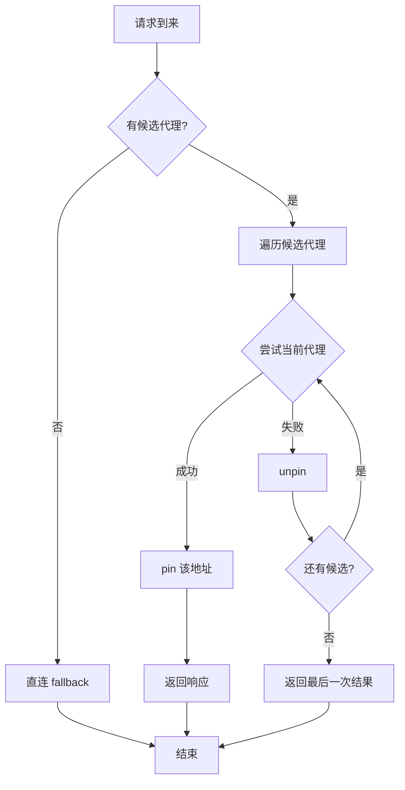
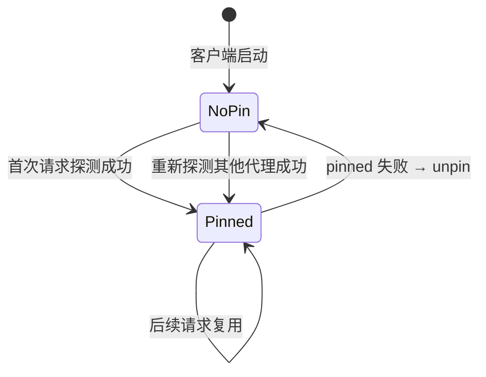

# Failover 代理传输层实现

> [!info] 文档定位
> 梳理 `common/bizpkg/proxy/failover.go` 中 `FailoverTransport` 的实现原理与设计思路，并与底层 [[整体代理(proxy)使用]] 中的 `HttpTransport` 进行对比。
>
> **适用模块**：`common/bizpkg/proxy`  
> **相关笔记**：[[整体代理(proxy)使用]] · [[华师匣子]] · [[华师匣子框架]] · [[华师匣子BFF结构]] · [[go-kratos 中间件实现]] · [[定时任务实现]] · [[cron 关闭兜底]] · [[robfig cron 的使用]] · [[整体gRPC 配置字段]]

## 目录

1. [背景与动机](#1-背景与动机)
2. [数据结构](#2-数据结构)
3. [核心实现](#3-核心实现)
   - 3.1 [构造函数](#31-构造函数)
   - 3.2 [RoundTrip 主流程](#32-roundtrip-主流程)
   - 3.3 [候选代理生成](#33-候选代理生成)
   - 3.4 [Transport 缓存](#34-transport-缓存)
   - 3.5 [Pin / Unpin 机制](#35-pin--unpin-机制)
   - 3.6 [请求克隆与 Body 重放](#36-请求克隆与-body-重放)
   - 3.7 [代理失败检测](#37-代理失败检测)
4. [装饰器模式](#4-装饰器模式)
5. [单元测试](#5-单元测试)
6. [与 HttpTransport 的对比](#6-与-httptransport-的对比)
7. [使用示例](#7-使用示例)
8. [已知限制](#8-已知限制)
9. [相关文件](#9-相关文件)

## 1. 背景与动机

原有的 `HttpTransport`（见 `common/bizpkg/proxy/roundtripper.go`）只支持**单代理地址**。当代理地址失效（认证失败、连接失败）时，请求直接报错，没有容灾路径。详细设计参见 [[整体代理(proxy)使用]]。

`FailoverTransport` 在 `HttpTransport` 之上构建了**四层容灾能力**：

- **Pin 机制**：记住当前可用的代理地址，避免每次重复探测
- **Failover 机制**：主代理失败时自动切换到备用代理
- **负载均衡**：多个客户端交替选择主/备代理，分散流量
- **Transport 缓存**：每个代理地址复用同一个 `HttpTransport` 实例

> [!tip] 设计原则
> `FailoverTransport` 是一个典型的**装饰器**（参考 [[go-kratos 中间件实现]] 中的中间件链思路）：不修改 `HttpTransport` 的实现，而是在外层组合多个 transport 实例，并增加跨 transport 的 failover/pin 逻辑。

## 2. 数据结构

```go
// common/bizpkg/proxy/failover.go:13
var failoverTransportSequence atomic.Uint64

// common/bizpkg/proxy/failover.go:18
type FailoverTransport struct {
    options []RoundTripperOption
    direct  *HttpTransport // 直连 fallback transport

    mu           sync.Mutex
    pinned       string                    // 当前 pin 的代理地址
    preferBackup bool                      // 是否优先使用备用代理
    transports   map[string]*HttpTransport // 代理地址 → Transport 缓存
}
```

### 字段说明

| 字段 | 类型 | 作用 |
|------|------|------|
| `options` | `[]RoundTripperOption` | 透传给底层 `HttpTransport` 的配置选项 |
| `direct` | `*HttpTransport` | 所有代理都失败时的**直连 fallback** |
| `pinned` | `string` | 当前会话绑定的代理地址（请求级 session） |
| `preferBackup` | `bool` | 初始探测阶段是否优先使用备用代理（实现负载均衡） |
| `transports` | `map[string]*HttpTransport` | 每个代理地址对应一个 transport 实例，**复用连接池** |

## 3. 核心实现

### 3.1 构造函数

```go
// common/bizpkg/proxy/failover.go:28
func NewFailoverTransport(options ...RoundTripperOption) *FailoverTransport {
    direct := globalProxy.NewProxyTransport()
    direct.Use(options...)
    return &FailoverTransport{
        options:      options,
        direct:       direct,
        preferBackup: failoverTransportSequence.Add(1)%2 == 0, // 奇偶交替
        transports:   make(map[string]*HttpTransport),
    }
}
```

**关键点**：

- 通过原子计数器 `failoverTransportSequence` 递增，==奇偶交替== 决定 `preferBackup`，使不同客户端实例分散到不同代理
- 直接创建一个直连 `HttpTransport` 作为最终 fallback

> [!note] 为什么用 `atomic.Uint64` 而不是普通计数器？
> `NewFailoverTransport` 可能被并发调用（如多个微服务启动时同时构造 client），使用原子操作避免锁开销，保证负载均衡分配的正确性。

### 3.2 RoundTrip 主流程

```go
// common/bizpkg/proxy/failover.go:39
func (t *FailoverTransport) RoundTrip(req *http.Request) (*http.Response, error) {
    candidates := t.proxyCandidates(req)
    if len(candidates) == 0 {
        return t.direct.RoundTrip(req) // 无代理时直连
    }

    var lastResp *http.Response
    var lastErr error
    for attempt, proxyAddr := range candidates {
        attemptReq, err := cloneRequestForAttempt(req, attempt)
        if err != nil {
            if lastResp != nil || lastErr != nil {
                return lastResp, lastErr
            }
            return nil, err
        }

        transport, err := t.transportFor(proxyAddr)
        if err != nil {
            lastErr = err
            continue
        }

        resp, roundTripErr := transport.RoundTrip(attemptReq)
        lastResp, lastErr = resp, roundTripErr
        if !isProxyFailure(resp, roundTripErr) {
            t.pin(proxyAddr)   // 成功 → pin 该地址
            return resp, roundTripErr
        }

        t.unpin(proxyAddr)    // 失败 → unpin
        if resp != nil && resp.Body != nil && attempt+1 < len(candidates) {
            _ = resp.Body.Close() // 关闭失败响应的 body，避免连接泄漏
        }
    }

    return lastResp, lastErr
}
```

**流程图**：



### 3.3 候选代理生成

```go
// common/bizpkg/proxy/failover.go:78
func (t *FailoverTransport) proxyCandidates(req *http.Request) []string {
    t.mu.Lock()
    pinned := t.pinned
    t.mu.Unlock()

    addrs := globalProxy.GetProxyAddr(req.Context(), 2)
    if pinned == "" && t.preferBackup && len(addrs) > 1 {
        addrs[0], addrs[1] = addrs[1], addrs[0] // 交换主备顺序
    }
    result := make([]string, 0, 3)
    seen := make(map[string]struct{}, 3)
    for _, addr := range append([]string{pinned}, addrs...) {
        addr = strings.TrimSpace(addr)
        if addr == "" {
            continue
        }
        if _, exists := seen[addr]; exists {
            continue
        }
        seen[addr] = struct{}{}
        result = append(result, addr)
    }
    return result
}
```

**候选顺序**：`[pinned, primary, backup]`（去重、空地址过滤）

**特殊情况**：

- 若 `pinned == ""` 且 `preferBackup == true`：主备顺序交换，**优先探测备用**
- 若 `pinned` 与主/备地址重复：**自动去重**

> [!example] 候选生成示例
> 假设 `pinned = "http://backup:80"`，`addrs = ["http://primary:80", "http://backup:80"]`：
> - 拼接后：`["http://backup:80", "http://primary:80", "http://backup:80"]`
> - 去重后：`["http://backup:80", "http://primary:80"]`
> - 此时 **pinned 的 backup 优先于 primary**，避免无谓切换。

### 3.4 Transport 缓存

```go
// common/bizpkg/proxy/failover.go:103
func (t *FailoverTransport) transportFor(proxyAddr string) (*HttpTransport, error) {
    t.mu.Lock()
    defer t.mu.Unlock()

    if transport, ok := t.transports[proxyAddr]; ok {
        return transport, nil
    }

    proxyURL, err := url.Parse(proxyAddr)
    if err != nil || proxyURL.Scheme == "" || proxyURL.Host == "" {
        return nil, fmt.Errorf("invalid proxy URL")
    }

    transport := globalProxy.NewProxyTransport()
    transport.Proxy = http.ProxyURL(proxyURL)
    transport.Use(t.options...)
    t.transports[proxyAddr] = transport
    return transport, nil
}
```

**设计要点**：

- 每个代理地址只创建一个 `HttpTransport`，==复用其底层 `http.Transport` 的连接池==
- URL 解析失败时直接报错，不缓存
- 通过 `http.ProxyURL(proxyURL)` 设置代理，避免每次重新设置

### 3.5 Pin / Unpin 机制

```go
// common/bizpkg/proxy/failover.go:123
func (t *FailoverTransport) pin(proxyAddr string) {
    t.mu.Lock()
    t.pinned = proxyAddr
    t.mu.Unlock()
}

func (t *FailoverTransport) unpin(proxyAddr string) {
    t.mu.Lock()
    if t.pinned == proxyAddr {
        t.pinned = ""
    }
    t.mu.Unlock()
}
```

**Pin 生命周期**：



### 3.6 请求克隆与 Body 重放

```go
// common/bizpkg/proxy/failover.go:137
func cloneRequestForAttempt(req *http.Request, attempt int) (*http.Request, error) {
    if attempt == 0 {
        return req, nil // 首次尝试直接复用
    }

    clone := req.Clone(req.Context())
    if req.Body == nil {
        return clone, nil
    }
    if req.GetBody == nil {
        return nil, errors.New("proxy failover: request body cannot be replayed")
    }
    body, err := req.GetBody()
    if err != nil {
        return nil, fmt.Errorf("proxy failover: recreate request body: %w", err)
    }
    clone.Body = body
    return clone, nil
}
```

**关键点**：

- `attempt == 0`：直接复用原请求，==避免不必要的克隆==
- `attempt > 0`：必须克隆请求，因为 `http.Request.Body` 是 `io.ReadCloser`，读取后无法重放
- 依赖 `req.GetBody` 回调（`http.NewRequest` 对 `body != nil` 会自动设置）

> [!warning] 调用方约束
> 如果调用方没有使用 `http.NewRequest` 而是手动构造请求且未设置 `GetBody`，**POST 重试会失败**。
> 业务侧应统一通过 `http.NewRequest` / `http.NewRequestWithContext` 构造请求。

### 3.7 代理失败检测

```go
// common/bizpkg/proxy/failover.go:157
func isProxyFailure(resp *http.Response, err error) bool {
    if resp != nil && resp.StatusCode == http.StatusProxyAuthRequired {
        return true
    }
    if err == nil {
        return false
    }
    message := strings.ToLower(err.Error())
    return strings.Contains(message, "proxy authentication failed") ||
        strings.Contains(message, "proxy authentication required") ||
        strings.Contains(message, "proxyconnect tcp")
}
```

**判定为代理失败的场景**：

- HTTP `407`（Proxy Authentication Required）
- 错误信息包含 `"proxy authentication failed"`
- 错误信息包含 `"proxy authentication required"`
- 错误信息包含 `"proxyconnect tcp"`（CONNECT 阶段失败）

> [!warning] 错误信息匹配的脆弱性
> 这里使用的是**字符串包含**匹配，不同 Go 版本或代理库的错误信息格式可能变化。
> 长期来看，应考虑定义 sentinel error 并用 `errors.Is` 进行判断。

## 4. 装饰器模式

`FailoverTransport` 是 `HttpTransport` 的**装饰器**，不修改 `HttpTransport` 的实现，而是在外层组合多个 transport 实例：

```text
http.Client
  ↓
FailoverTransport (http.RoundTripper)
  ↓ 选择候选代理
HttpTransport[proxy-1] (http.RoundTripper)
  ↓
http.Transport → 实际 TCP 连接
```

这种分层设计与 [[go-kratos 中间件实现]] 中的**中间件链**思想一致：每层只关心自己的职责，通过组合扩展能力。

| 层级 | 职责 |
|------|------|
| `FailoverTransport` | 跨代理的 failover、pin、负载均衡 |
| `HttpTransport` | 单代理的 transport 封装、连接池管理 |
| `http.Transport` | 实际 TCP 连接、TLS、Keep-Alive |

## 5. 单元测试

文件：`common/bizpkg/proxy/failover_test.go`

### 5.1 Pin 后切换验证

```go
// failover_test.go:12 TestFailoverTransportRetriesBackupAndPinsIt
// 验证：主代理返回 407 → 切换到备代理 → 后续请求直接用备代理
```

**断言**：

- 主代理只被调用 ==1== 次
- 备代理被调用 ==2== 次（首次重试 + 后续 pin）

### 5.2 POST Body 重放验证

```go
// failover_test.go:52 TestFailoverTransportReplaysPostBody
// 验证：POST 请求失败后重试，body 能正确传递
```

**断言**：备代理收到的 body 为 `"a=1"`

### 5.3 初始代理负载均衡验证

```go
// failover_test.go:86 TestFailoverTransportAlternatesInitialProxy
// 验证：连续创建两个 client，第一个用 primary，第二个用 backup
```

**断言**：

- `first[0] == "http://primary:80"`
- `second[0] == "http://backup:80"`

> [!tip] 测试模式
> 这三个测试使用了 `httptest.Server` 模拟代理，配合 `atomic.Int32` 计数请求次数，是 Go 中测试 `http.RoundTripper` 的标准做法。

## 6. 与 HttpTransport 的对比

| 维度 | `HttpTransport` | `FailoverTransport` |
|------|------------------|---------------------|
| **代理数量** | 单代理（主备二选一） | 多代理（pinned + primary + backup） |
| **失败处理** | 直接返回错误 | 自动 failover 到备用 |
| **会话保持** | 每次重新选代理 | Pin 成功的代理 |
| **负载均衡** | 总是优先主代理 | 客户端级别交替选择 |
| **连接复用** | 单 Transport 池 | 每个代理独立 Transport 池 |
| **POST 重试** | 不支持 | 通过 `GetBody` 支持 |
| **直连 fallback** | 无 | `direct *HttpTransport` |

## 7. 使用示例

```go
client := &http.Client{
    Transport: proxy.NewFailoverTransport(
        proxy.WithMaxIdleConns(100),
        proxy.WithIdleConnTimeout(60 * time.Second),
    ),
}
resp, err := client.Get("http://target.example.com")
```

更多调用方式参见 [[整体代理(proxy)使用#微服务中的调用方式]]。

## 8. 已知限制

1. **依赖全局 `globalProxy`**：与 `HttpTransport` 一样，依赖 `http.go` 中的包级变量。详见 [[整体代理(proxy)使用#已知问题]]。
2. **`GetBody` 必须设置**：POST/PUT 等带 body 的请求若未通过 `http.NewRequest` 创建，**重试会失败**。
3. **不支持动态添加代理**：代理地址只从 `globalProxy.GetProxyAddr` 获取。
4. **Pinning 是客户端级**：不同 `FailoverTransport` 实例之间**不共享 pin 状态**。
5. **Failure 检测基于错误信息匹配**：不同 Go 版本/库的 error 信息格式可能变化（参见 [[pitfalls]] 中关于 sentinel error 的讨论）。

## 9. 相关文件

| 路径 | 作用 |
|------|------|
| `common/bizpkg/proxy/failover.go` | `FailoverTransport` 实现 |
| `common/bizpkg/proxy/failover_test.go` | 单元测试 |
| `common/bizpkg/proxy/http.go` | `globalProxy`、`HttpProxy` 定义 |
| `common/bizpkg/proxy/roundtripper.go` | `HttpTransport` 定义 |
| `common/bizpkg/proxy/proxy.go` | 核心接口（`Getter`, `Client`, `Transporter`） |

> 相关说明：[[整体代理(proxy)使用]] · [[go-kratos 中间件实现]] · [[华师匣子框架]]
