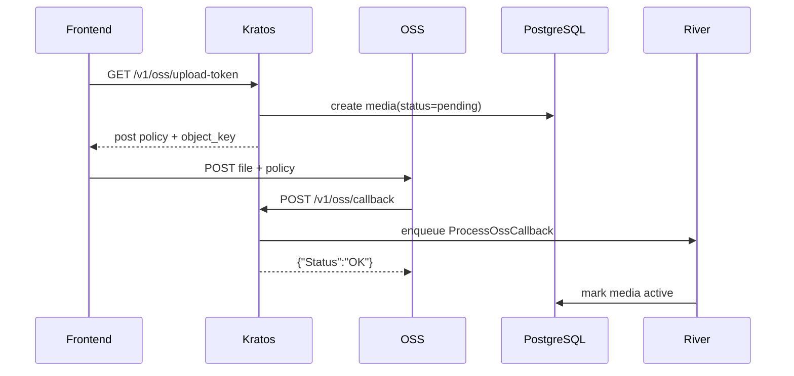

# OSS 直传流程

前端直传指文件直接从浏览器上传到对象存储，Kratos 只参与凭证签发、回调接收和业务状态维护。

## API

| 接口 | 调用方 | 作用 |
|------|--------|------|
| `GET /v1/oss/upload-token` | 前端 | 获取上传凭证、对象 Key 和过期时间 |
| `POST /v1/oss/callback` | OSS | 通知后端文件已上传成功 |

## 交互步骤

1. 用户选择文件，前端先做大小和类型校验。
2. 前端调用 `GET /v1/oss/upload-token`。
3. Kratos 生成受限 PostPolicy，必要时预创建 `pending` 媒体记录。
4. Kratos 返回上传地址、对象 Key、过期时间和表单字段。
5. 前端使用 `multipart/form-data` 直接 POST 到 OSS。
6. OSS 保存对象后请求 `/v1/oss/callback`。
7. Kratos 校验回调签名并投递异步落库任务。
8. Kratos 返回 OSS 期望的成功响应。
9. 前端根据上传请求结果展示预览，并可轮询或查询后端确认业务状态。

## 注意点

- 回调接口必须公网可达，且不能被 JWT 中间件拦截。
- 前端不能把“拿到凭证”当成上传成功。
- OSS 回调可能重复到达，落库逻辑必须幂等。
- 本地 MinIO 的回调语义与阿里云 OSS 不完全一致，见 [[OSS 回调语义差异]]。

## 相关链接

- [[OSS 实现]]
- [[OSS 上传凭证]]
- [[OSS 回调处理]]
- [[OSS + MQ整体流程]]
