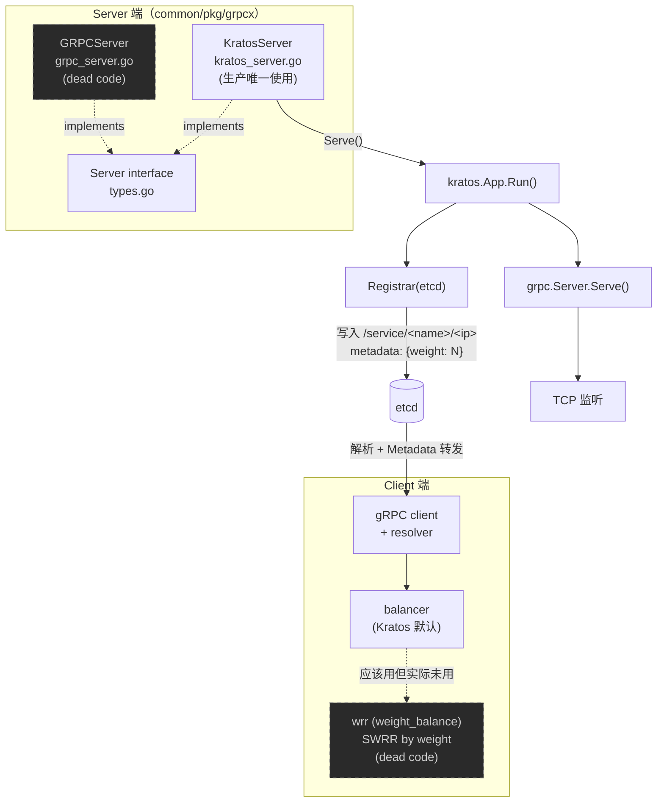

# gRPCx 的封装

> **适用版本**：`go.etcd.io/etcd/client/v3 v3.6.7` · `google.golang.org/grpc v1.77.0` · `go-kratos/kratos/v2 v2.9.2`
>
> **适用模块**：`common/pkg/grpcx`  
> **相关笔记**：[[华师匣子]] · [[华师匣子框架]] · [[华师匣子BFF结构]] · [[华师匣子-代码结构]] · [[整体gRPC 配置字段]] · [[go-kratos 中间件实现]] · [[整体代理(proxy)使用]] · [[cron 关闭兜底]] · [[go-kratos架构]]

## 目录

1. [目录结构](#1-目录结构)
2. [文件逐个拆解](#2-文件逐个拆解)
   - 2.1 [`types.go` — 抽象接口](#21-typesgo--抽象接口)
   - 2.2 [`grpc_server.go` — 原生 gRPC + etcd 端点注册](#22-grpc_servergo--原生-grpc--etcd-端点注册)
   - 2.3 [`kratos_server.go` — Kratos 框架 gRPC Server](#23-kratos_servergo--kratos-框架-grpc-server)
   - 2.4 [`balancer/wrr/weight_balance.go` — 自定义加权轮询](#24-balancerwrrweight_balancego--自定义加权轮询)
3. [潜在问题清单](#3-潜在问题清单)
4. [整体架构图](#4-整体架构图)
5. [总结与建议](#5-总结与建议)

## 1. 目录结构

```text
common/pkg/grpcx/
├── types.go                       # 统一抽象接口
├── grpc_server.go                 # 原生 gRPC Server + etcd 端点注册
├── kratos_server.go               # Kratos 框架 gRPC Server + etcd 注册
└── balancer/wrr/
    └── weight_balance.go          # 自定义平滑加权轮询负载均衡器
```

## 2. 文件逐个拆解

### 2.1 `types.go` — 抽象接口

```go
// types.go:3
type Server interface {
    Serve() error
    Close() error
}
```

为下面的两种具体实现提供**统一抽象**。所有 `be-*` 服务的 `main.go` 通过依赖注入得到 `grpcx.Server`，无需关心底层是原生 gRPC 还是 Kratos（参见 [[华师匣子框架#分层架构]]）。

### 2.2 `grpc_server.go` — 原生 gRPC + etcd 端点注册

#### 2.2.1 结构体 `grpc_server.go:18`

| 字段             | 类型                  | 作用                                       |
| -------------- | ------------------- | ---------------------------------------- |
| `*grpc.Server` | 嵌入                  | 可直接调用 `RegisterService`、`GracefulStop` 等 |
| `Port`         | `int`               | 监听端口                                     |
| `EtcdTTL`      | `int64`             | etcd 租约 TTL（单位：秒）                        |
| `EtcdClient`   | `*clientv3.Client`  | etcd v3 客户端                              |
| `etcdManager`  | `endpoints.Manager` | etcd 端点管理器（`Close` 时用于摘除端点）              |
| `etcdKey`      | `string`            | etcd 上的完整 key                            |
| `cancel`       | `func()`            | 用于关闭时取消内部 ctx                            |
| `Name`         | `string`            | 服务名                                      |
| `L`            | `logger.Logger`     | 日志器                                      |

#### 2.2.2 `Serve()` 启动流程 — `grpc_server.go:32`

```go
func (s *GRPCServer) Serve() error {
    ctx, cancel := context.WithCancel(context.Background())  // L35
    s.cancel = cancel                                         // L36
    port := strconv.Itoa(s.Port)                              // L37
    l, err := net.Listen("tcp", ":"+port)                     // L38
    if err != nil { return err }
    err = s.register(ctx, port)                               // L43
    if err != nil { return err }
    return s.Server.Serve(l)                                  // L47
}
```

1. `context.WithCancel` 拿到生命周期控制句柄，保存到 `s.cancel`，`Close` 时调用。
2. `net.Listen("tcp", ":"+port)` 监听端口，失败立即返回。
3. **先注册后 Serve**：`s.register(ctx, port)` 成功后才真正 `Serve(l)`。注释 `grpc_server.go:42` 明确说明：==避免 gRPC 接收流量但 etcd 还没注册、客户端查不到的情况==。
4. `s.Server.Serve(l)` 阻塞，出错即返回。

#### 2.2.3 `register()` 注册到 etcd — `grpc_server.go:50`

```go
func (s *GRPCServer) register(ctx context.Context, port string) error {
    cli := s.EtcdClient
    serviceName := "service/" + s.Name                            // L52
    em, err := endpoints.NewManager(cli, serviceName)              // L53
    if err != nil { return err }
    s.etcdManager = em
    ip := netx.GetOutboundIP()                                    // L59
    s.etcdKey = serviceName + "/" + ip                            // L60
    addr := ip + ":" + port
    leaseResp, err := cli.Grant(ctx, s.EtcdTTL)                   // L62
    ch, err := cli.KeepAlive(ctx, leaseResp.ID)                   // L64
    if err != nil { return err }
    go func() {
        for chResp := range ch {                                   // L69
            s.L.Debug("续约：", logger.String("resp", chResp.String()))
        }
    }()
    return em.AddEndpoint(ctx, s.etcdKey,                         // L73
        endpoints.Endpoint{Addr: addr}, clientv3.WithLease(leaseResp.ID))
}
```

执行步骤：

1. **创建 endpoints Manager**（`grpc_server.go:53`）：key 前缀为 `service/<Name>`。
2. **获取本机出站 IP**（`grpc_server.go:59`）：通过 `netx.GetOutboundIP()`（`common/pkg/netx/ip.go:6`）用 UDP `Dial("8.8.8.8:80")` 后取 `LocalAddr`，**不真正发包**。dial 失败时返回空字符串（详见 [§3.3](#33-netxgetoutboundip-失败时注册异常--commonpkgnetxipgo6-15--grpc_servergo59-61)）。
3. **构造 etcd key**：`service/<Name>/<ip>`（`grpc_server.go:60`）。
4. **申请租约**：`cli.Grant(ctx, EtcdTTL)`（`grpc_server.go:62`）。
5. **开启续约**：`cli.KeepAlive(ctx, leaseID)` 返回 channel（`grpc_server.go:64`）。
6. **后台消费 channel**：`grpc_server.go:68-72` 起 goroutine 持续读取续约响应，只打 Debug 日志。

> [!warning] 关键约束
> channel **必须有人读**，否则 etcd 端 KeepAlive 内部会阻塞，租约到期后端点消失，服务"跑一会就掉线"。

7. **注册端点**：`em.AddEndpoint(ctx, key, {Addr: ip:port}, WithLease(leaseID))`（`grpc_server.go:73-74`），把端点绑到租约，租约过期自动下线。

#### 2.2.4 `Close()` 优雅关闭 — `grpc_server.go:77`

```go
func (s *GRPCServer) Close() error {
    s.cancel()                                                    // L78
    if s.etcdManager != nil {
        ctx, cancel := context.WithTimeout(context.Background(), time.Second) // L80
        defer cancel()
        err := s.etcdManager.DeleteEndpoint(ctx, s.etcdKey)       // L82
        if err != nil { return err }                              // 早退
    }
    err := s.EtcdClient.Close()                                   // L87
    if err != nil { return err }
    s.Server.GracefulStop()                                       // L91
    return nil
}
```

关闭顺序：**cancel ctx → 摘 etcd 端点 → 关 etcd 客户端 → GracefulStop**。

- `s.cancel()` 触发 `register` 内部 KeepAlive 退出。
- `DeleteEndpoint` 从 etcd 主动摘掉自己，避免租约期内被调用到。
- `GracefulStop()` 等待在途 RPC 完成。

### 2.3 `kratos_server.go` — Kratos 框架 gRPC Server

#### 2.3.1 结构体 `kratos_server.go:14`

| 字段 | 类型 | 与 `GRPCServer` 的差异 |
|------|------|------------------------|
| `*grpc.Server` | `kratos/v2/transport/grpc.Server` | Kratos 包装的 gRPC Server，带 middleware/transport 元信息 |
| `Name` | `string` | — |
| `Weight` | `int` | **新增**：写进 `kratos.Metadata`，供客户端 wrr 均衡器读取 |
| `EtcdTTL` | `time.Duration` | **单位不同**：`GRPCServer` 是 `int64` 秒，这里是 `time.Duration` |
| `EtcdClient` | `*etcdv3.Client` | — |
| `stop` | `func() error` | 保存 `app.Stop` 供 `Close` 调用 |
| `L` | `logger.Logger` | — |

#### 2.3.2 `Serve()` — `kratos_server.go:25`

```go
func (s *KratosServer) Serve() error {
    r := etcd.New(s.EtcdClient, etcd.RegisterTTL(s.EtcdTTL))       // L26
    app := kratos.New(
        kratos.Metadata(map[string]string{                         // L28
            "weight": strconv.Itoa(s.Weight),
        }),
        kratos.Name(s.Name),
        kratos.Server(s.Server),
        kratos.Registrar(r),                                       // L35
    )
    s.stop = app.Stop                                              // L37
    return app.Run()                                              // L38
}
```

1. 用 `github.com/go-kratos/kratos/contrib/registry/etcd/v2` 包装 etcd 客户端，设置注册 TTL。
2. 构造 Kratos `App`，通过 `Metadata` 注入 `weight`，Kratos 在注册到 etcd 时会把 `weight` 写入 endpoints 元数据。
3. `app.Stop` 保存为 `s.stop`，`app.Run()` 阻塞。

#### 2.3.3 `Close()` — `kratos_server.go:41`

```go
func (s *KratosServer) Close() error {
    err := s.EtcdClient.Close()                                   // L42
    if err != nil { return err }
    return s.stop()                                               // L46
}
```

Kratos 内部 `app.Stop` 会触发 Registrar 解注册、Server 优雅停止，理论上应该先 `stop` 再关 etcd 客户端。**当前实现顺序有问题**（详见 [§3.5](#35-kratosserverclose-顺序错误--kratos_servergo41-46)）。

### 2.4 `balancer/wrr/weight_balance.go` — 自定义加权轮询

#### 2.4.1 概览

实现的是**平滑加权轮询**（Smooth Weighted Round Robin, SWRR），效果类似 Nginx 的 `wrr`：权重大的节点不会"扎堆"被选中，流量是平滑分散的。

#### 2.4.2 注册 — `weight_balance.go:9-18`

```go
const WeightRoundRobin = "custom_weighted_round_robin"           // L9

func newBuilder() balancer.Builder {                              // L11
    return base.NewBalancerBuilder(WeightRoundRobin,
        &WeightedPickerBuilder{}, base.Config{HealthCheck: true})
}

func init() {                                                     // L16
    balancer.Register(newBuilder())
}
```

- `newBuilder()`（`L11`）：用 `base.NewBalancerBuilder` 构建 builder，开启 `HealthCheck: true`。
- `init()`（`L16`）：在包加载时把 builder 注册到 gRPC 内部，client 端 `import _ ".../wrr"` 即可生效。

> [!warning] 实际未被使用
> 实际工程中没有任何地方 import 这个包，常量 `WeightRoundRobin` 也未被任何 client 配置使用（详见 [§3.8](#38-wrr-balancer-是-dead-code--weight_balancego9-18)）。

#### 2.4.3 `WeightedPickerBuilder.Build()` — `weight_balance.go:56`

```go
func (b *WeightedPickerBuilder) Build(info base.PickerBuildInfo) balancer.Picker {
    conns := make([]*weightConn, 0, len(info.ReadySCs))
    for con, conInfo := range info.ReadySCs {
        weightVal, _ := conInfo.Address.Metadata.(map[string]any)["weight"] // L60
        weight, _ := weightVal.(float64)                                   // L62
        conns = append(conns, &weightConn{
            SubConn:       con,
            weight:        int(weight),
            currentWeight: int(weight),                                    // L66
        })
    }
    return &WeightedPicker{conns: conns}
}
```

遍历 gRPC 给的"健康子连接"，从 `Address.Metadata` 里读 `weight` 字段：

- `L60`：`Metadata` 类型断言为 `map[string]any`，失败返回零值 map。
- `L62`：再断言 value 为 `float64`。注释 `L61` 提醒：**经过注册中心（JSON）转发后，数字是 `float64` 而不是 `int`**，直接断言 `int` 会失败。
- 把 `weight` 和 `currentWeight` 都初始化为 weight。

#### 2.4.4 `WeightedPicker.Pick()` — 核心算法 `weight_balance.go:25`

```go
func (b *WeightedPicker) Pick(info balancer.PickInfo) (balancer.PickResult, error) {
    if len(b.conns) == 0 {
        return balancer.PickResult{}, balancer.ErrNoSubConnAvailable  // L27
    }
    var totalWeight int
    var res *weightConn

    b.mutex.Lock()                                                  // L33
    for _, node := range b.conns {
        totalWeight += node.weight                                  // L35
        node.currentWeight += node.weight                           // L36
        if res == nil || res.currentWeight < node.currentWeight {   // L37
            res = node
        }
    }
    res.currentWeight -= totalWeight                               // L41
    b.mutex.Unlock()
    return balancer.PickResult{
        SubConn: res.SubConn,
        Done: func(info balancer.DoneInfo) { /* 空实现 */ },       // L45
    }, nil
}
```

经典 SWRR 算法：

```text
totalWeight = Σ weight_i
for each node:
    node.currentWeight += node.weight
    res = argmax(node.currentWeight)
res.currentWeight -= totalWeight
return res
```

- `L33` 加锁：保证 `currentWeight` 修改原子。`b.conns` 在 Build 阶段拷贝，运行期只读，故锁只保护 `currentWeight`。
- `L29` 注释说"实时计算 totalWeight 是为了方便你动态调整权重"，但**算法实际并不读取外部权重变化**——`weight` 字段在 `Build` 阶段就被锁进 `weightConn` 了，后续 Pick 不会重新读 metadata（详见 [§3.11](#311-动态调整权重注释具有误导性--weight_balancego29)）。
- `Done` 回调（`L45`）留空，意味着**没有 failover 降权机制**（详见 [§3.13](#313-done-回调空实现无-failover-降权--weight_balancego45-50)）。

#### 2.4.5 `weightConn` — `weight_balance.go:74`

```go
type weightConn struct {
    weight        int      // 初始权重（从 metadata 读）
    currentWeight int      // 当前权重（算法状态）
    balancer.SubConn       // 嵌入
}
```

## 3. 潜在问题清单

> 严重度图例：**[高]**（可能 panic / 资源泄露）· **[中]**（行为异常）· **[低]**（代码风格 / 可疑）

### [中] 1. `GRPCServer` 是 dead code — `grpc_server.go:18`

> [!note] 严重度：中

全工程没有任何地方实例化 `grpcx.GRPCServer`，所有 `be-*` 服务的 `InitGRPCxKratosServer`（`common/bizpkg/grpc/server/server.go:53`）都构造的是 `grpcx.KratosServer`。

**建议**：要么删掉 `grpc_server.go` 整个文件，要么在 README 中标注"仅供非 Kratos 服务参考"。

### [高] 2. `cli.Grant` 失败时 KeepAlive 会 panic — `grpc_server.go:62-64`

> [!error] 严重度：高（可能 panic）

```go
leaseResp, err := cli.Grant(ctx, s.EtcdTTL)   // err 未检查
ch, err := cli.KeepAlive(ctx, leaseResp.ID)   // leaseResp 可能为 nil
```

- `cli.Grant` 返回的 `err` 没有检查（`L62`）。
- 如果 Grant 失败，`leaseResp` 是 nil（零值），`leaseResp.ID` 是 `clientv3.LeaseID(0)`，传给 KeepAlive 后，etcd client 内部对 `LeaseID(0)` 的处理可能 panic，或行为未定义。

**修复**：在 `L62` 之后立即 `if err != nil { return err }`。

### [高] 3. `netx.GetOutboundIP()` 失败时注册异常 — `common/pkg/netx/ip.go:6-15` → `grpc_server.go:59-61`

> [!error] 严重度：高（注册后客户端无法解析）

```go
// netx/ip.go
func GetOutboundIP() string {
    conn, err := net.Dial("udp", "8.8.8.8:80")
    if err != nil {
        return ""                  // 失败时返回空串
    }
    ...
}
```

如果 UDP `Dial("8.8.8.8:80")` 失败（无外网、DNS 不可用、权限不足等）：

- `ip` 为 `""`
- etcd key 变成 `service/<name>/`
- 注册到 etcd 的 `addr` 变成 `":<port>"`
- 客户端解析后会得到一个非法地址

**修复**：`GetOutboundIP` 失败时返回 error，调用方在 `grpc_server.go:59` 之后判断 `ip == ""` 立即返回 error 终止启动。

### [高] 4. `AddEndpoint` 失败时 etcd lease 泄露 — `grpc_server.go:64-74`

> [!error] 严重度：高（资源泄露）

```go
ch, err := cli.KeepAlive(ctx, leaseResp.ID)
if err != nil { return err }
go func() { for chResp := range ch { ... } }()    // KeepAlive goroutine
return em.AddEndpoint(ctx, s.etcdKey,
    endpoints.Endpoint{Addr: addr}, clientv3.WithLease(leaseResp.ID))
```

- `AddEndpoint` 失败时（etcd 临时不可写等），函数 return error；
- 此时 lease 已经在 etcd 上创建，`KeepAlive` 协程已在跑（`L68` 已在 `L73` 之前执行）；
- 但端点并没有真正被注册，`Serve` 也会因为 `err != nil` 退出（`L44`）；
- etcd 上的 lease 只能等 TTL 过期，租约 ID 也没暴露给外面去 revoke → ==资源短期泄露==。

**修复**：`AddEndpoint` 失败时 `cli.Revoke(ctx, leaseResp.ID)` 主动撤销，并在 KeepAlive 协程外加 `ctx.Done()` 退出条件。

### [中] 5. `KratosServer.Close()` 顺序错误 — `kratos_server.go:41-46`

> [!warning] 严重度：中

```go
func (s *KratosServer) Close() error {
    err := s.EtcdClient.Close()     // L42 先关 etcd 连接
    if err != nil { return err }
    return s.stop()                 // L46 再 app.Stop
}
```

`app.Stop` 内部会触发 Registrar 解注册（通过 `s.EtcdClient`），但此时客户端已 `Close()`，**解注册会失败**。

**修复**：交换顺序 —— 先 `s.stop()`，再 `s.EtcdClient.Close()`，且 stop 失败时也要尝试关 etcd client。

### [中] 6. `EtcdTTL` 字段类型不一致 — `grpc_server.go:22` vs `kratos_server.go:18`

> [!note] 严重度：中

| 类型 | 字段 | 单位 |
|------|------|------|
| `GRPCServer.EtcdTTL` | `int64` | **秒** |
| `KratosServer.EtcdTTL` | `time.Duration` | 纳秒（由 `time.Second * N` 构造） |

调用方（`common/bizpkg/grpc/server/server.go:57`）写的是 `time.Second * time.Duration(newCfg.EtcdTTL)`，可见底层配置是秒，但两种 Server 字段类型不一致，极易在写新代码时把秒当 Duration 传过去。详见 [[整体gRPC 配置字段]]。

**建议**：`GRPCServer.EtcdTTL` 也改为 `time.Duration`，与 Kratos 对齐。

### [中] 7. `endpoints.NewManager` 已 deprecated — `grpc_server.go:53`

> [!note] 严重度：中

```go
em, err := endpoints.NewManager(cli, serviceName)  // etcd/client/v3/naming/endpoints
```

依赖 `go.etcd.io/etcd/client/v3/naming/endpoints`，etcd v3.5+ 已标记 deprecated，v3.6.7 编译会告警。这是 `GRPCServer` dead code 的另一面证据 —— 新代码应走 Kratos 的 registry 抽象。

### [中] 8. `wrr` balancer 是 dead code — `weight_balance.go:9-18`

> [!note] 严重度：中

```bash
$ grep -r "custom_weighted_round_robin\|grpcx/balancer/wrr" --include="*.go"
common/pkg/grpcx/balancer/wrr/weight_balance.go:9: const WeightRoundRobin = ...
common/pkg/grpcx/balancer/wrr/weight_balance.go:12: return base.NewBalancerBuilder(WeightRoundRobin, ...
```

- 没有 client 端 `import _ "..../wrr"` 触发 `init()`
- 常量 `WeightRoundRobin` 也未被任何 client 连接配置引用
- gRPC 客户端实际使用的是 Kratos 默认 balancer，**完全没有按 `weight` 字段分流**

**建议**：要么删掉，要么在某个 BFF/客户端入口添加 blank import 并把 balancer name 配到 client option。

### [中] 9. `base.Config{HealthCheck: true}` 在新版本 gRPC 行为变化 — `weight_balance.go:13`

> [!note] 严重度：中

gRPC v1.77 中 `base.NewBalancerBuilder` 仍接受这个字段，但 `HealthCheck` 已经被 `health.CheckAggregator` 取代。`true` 仍然能工作但官方推荐改用独立的 health check client，否则在某些场景下 health check 行为不稳定。

### [中] 10. `weight` 类型断言失败时静默退化为 0 — `weight_balance.go:60-66`

> [!warning] 严重度：中（静默退化）

```go
weightVal, _ := conInfo.Address.Metadata.(map[string]any)["weight"]  // L60
weight, _ := weightVal.(float64)                                     // L62
```

两处 `, _` 吞掉了所有错误：

- 如果 `Metadata` 不是 `map[string]any` 类型（比如某些 resolver 用 `map[string]string`），`weightVal` 永远是 `nil`；
- 强转 `float64` 也失败，`weight = 0`；
- 当**所有节点** weight 都是 0 时，SWRR 退化为 `totalWeight = 0`，Pick 实际行为变成非加权轮询，但**日志没有任何告警**。

**修复**：`L62` 改成 `if v, ok := weightVal.(float64); ok { weight = int(v) } else { log.Warn(...) }`。

### [中] 11. "动态调整权重"注释具有误导性 — `weight_balance.go:29`

> [!note] 严重度：中（文档与实现不一致）

```go
// 这里实时计算 totalWeight 是为了方便你作业动态调整权重
var totalWeight int
```

实际行为：

- `weightConn.weight` 在 `Build()` 阶段（`L65`）从 metadata 拷贝一次，运行期不再读 metadata；
- etcd 上的 `weight` 改了以后，需要 etcd watcher 触发 resolver 重新解析、balancer 重新 `Build`，**新 picker 才会拿到新 weight**；
- `totalWeight` 是"每轮重算"而不是"动态感知外部变化"。

**修复**：注释改成"为支持热更新后重新 Build 时取最新权重"，或补上 resolver 事件 → resolver.Build 的链路说明。

### [低] 12. `Pick` 的 `info` 参数未使用 — `weight_balance.go:25`

> [!note] 严重度：低（代码风格）

```go
func (b *WeightedPicker) Pick(info balancer.PickInfo) (balancer.PickResult, error)
```

签名里 `info` 没有任何使用，IDE 会提示 unused。可考虑根据 `info.Ctx` 选节点（比如按 header 路由），或直接删掉参数（签名固定不能删，加个 `_ = info`）。

### [中] 13. `Done` 回调空实现，无 failover 降权 — `weight_balance.go:45-50`

> [!warning] 严重度：中（无降权机制）

```go
Done: func(info balancer.DoneInfo) {
    // 在这里执行 failover 有关的事情
    // 例如说把 res 的 currentWeight 进一步调低到一个非常低的值
    // 也可以直接把 res 从 b.conns 删除
},
```

注释说"可以在这里做"，但实际什么都没做 —— 失败的子连接**不会**降权，下一轮 Pick 仍然可能选中它，导致请求持续失败直到 gRPC health check 把它踢出 `ReadySCs`。

**修复**：至少在 `info.Err != nil` 时对 `res` 做降权（例如 `currentWeight -= totalWeight * 2`）。

### [低] 14. `Close` 早退导致后续清理被跳过 — `grpc_server.go:82-92`

> [!note] 严重度：低

```go
err := s.etcdManager.DeleteEndpoint(ctx, s.etcdKey)
if err != nil { return err }      // 早退
...
err := s.EtcdClient.Close()       // 不会再执行
if err != nil { return err }
s.Server.GracefulStop()           // 不会再执行
```

如果 `DeleteEndpoint` 失败（etcd 抖动），`EtcdClient.Close()` 和 `GracefulStop()` 都不会执行 —— 进程会带着还在监听端口的 gRPC server 退出，可能导致：

- 端口未释放
- in-flight RPC 被强制中断

**修复**：收集错误最后统一返回，或在某步失败时仍继续后续清理步骤。

### [低] 15. `s.Server.GracefulStop()` 错误被丢弃 — `grpc_server.go:91`

> [!note] 严重度：低

`GracefulStop` 在新版 gRPC 中返回 `error`，这里被直接忽略。建议至少 `s.L.Warn("graceful stop", logger.Error(err))`。

### [低] 16. `GRPCServer` 的 `cancel` 在 `Listen` 失败时悬挂 — `grpc_server.go:35-40`

> [!note] 严重度：低

```go
ctx, cancel := context.WithCancel(...)
s.cancel = cancel       // 已保存
l, err := net.Listen(...)
if err != nil { return err }   // cancel 永远不会被调用
```

`Serve` 失败返回时，`s.cancel` 已写入但不会被触发，持有 cancel 的结构体被 GC 后才释放 —— 影响极小，但暴露了一个设计问题：应该让 `Serve` 在启动失败路径上调用 `s.cancel()` 后再 return。

## 4. 整体架构图



**关键结论**：

- 唯一在生产链路中真正生效的是 `KratosServer` + Kratos 默认 balancer。
- `GRPCServer` 与 `wrr` balancer 属于**历史遗存的 dead code**（虚线框），但仍占据编译产物与维护心智。
- etcd 的 `metadata.weight` 字段**已经写出去**，但**没有被任何客户端消费**。

## 5. 总结与建议

| 类别 | 数量 |
|------|------|
| [高] 危问题（panic / 资源泄露） | 3 |
| [中] 危问题（行为异常 / 静默退化） | 7 |
| [低] 危问题（代码风格） | 3 |
| Dead code | 2（`GRPCServer` + `wrr` balancer） |

**优先建议**：

1. **修 panic 风险**：检查 `cli.Grant` 错误（`grpc_server.go:62`）、`netx.GetOutboundIP` 失败路径（`grpc_server.go:59`）。
2. **修资源泄露**：`AddEndpoint` 失败时 revoke lease（`grpc_server.go:73`）。
3. **修顺序问题**：`KratosServer.Close` 调换 stop 与 etcd 关闭顺序（`kratos_server.go:42-46`）。
4. **决定去留**：`GRPCServer` 与 `wrr` balancer 是否还需要保留，或彻底删除。

## 跨主题链接

- [[华师匣子]] — 项目总览
- [[华师匣子框架]] — 整体分层、依赖注入与服务治理
- [[华师匣子-代码结构]] — 仓库目录与构建脚本
- [[华师匣子BFF结构]] — BFF 层的 gRPC 客户端使用
- [[整体gRPC 配置字段]] — `GrpcConf` 的拆分与 EtcdTTL 单位统一
- [[go-kratos 中间件实现]] — Kratos 中间件链（与 Kratos gRPC Server middleware 同源）
- [[整体代理(proxy)使用]] — 出站 HTTP 代理（与本模块的入站 gRPC 互补）
- [[cron 关闭兜底]] — Kratos 优雅停机链路
- [[go-kratos架构]] — Kratos 框架自身的分层思想
- [[pitfalls]] — 通用工程陷阱清单
