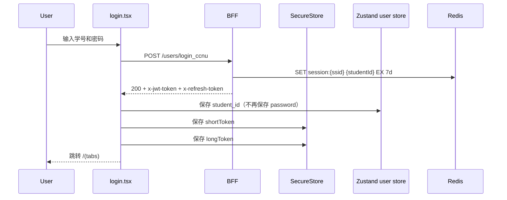
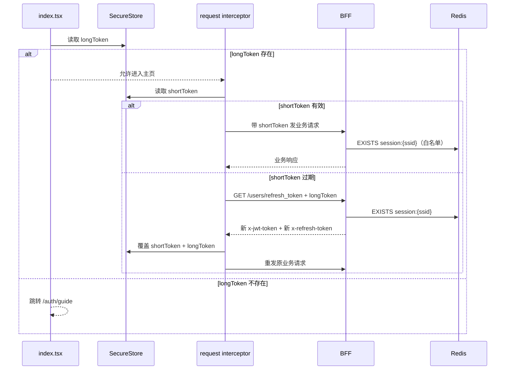

# JWT 登录态持久化与认证体系分析

本文档从端到端视角说明当前项目的 JWT 认证体系：前端如何持久化登录态、后端如何签发与校验 Token、两套逻辑如何交互，以及当前存在的系统性问题与重构方案。

> 后端 JWT 实现细节另见 [[BFF JWT部分耦合过重]] 与 [[BFF JWT 中存储加密密码的安全性分析]]。本文侧重前后端衔接与端到端问题诊断。

---

## 1. 认证架构总览

项目采用**双 Token + 黑名单会话**方案：

| Token | 有效期 | 职责 | 存储位置 |
|-------|--------|------|----------|
| `shortToken`（Access Token） | 1 小时 | 业务接口认证 | 前端 `expo-secure-store` |
| `longToken`（Refresh Token） | 6 个月 | 换取新的 Access Token | 前端 `expo-secure-store` |
| Redis `ssid:{id}` | 6 个月 | 后端会话黑名单（注销标记） | 后端 Redis |

### 1.1 核心交互流程

```
登录
  │
  ├── 前端 ──[学号/明文密码]──> BFF POST /users/login_ccnu
  │                              │
  │                              ├── BFF 校验密码（调用 be-user）
  │                              ├── BFF AES-GCM 加密密码
  │                              ├── BFF 将加密密码写入 JWT Claims
  │                              ├── BFF 签发 shortToken（1h）+ longToken（6m）
  │                              └── BFF 返回 x-jwt-token + x-refresh-token
  │
  ├── 前端保存 shortToken / longToken 到 SecureStore
  └── 前端保存 student_id / password 到 Zustand persist → SecureStore

业务请求
  │
  ├── 前端读取 shortToken → Authorization: Bearer <shortToken>
  ├── BFF Middleware 解析 JWT → 提取加密密码 → AES-GCM 解密 → 明文密码
  ├── BFF Middleware 调用 SaveUser（每请求回写明文密码到 be-user）
  ├── BFF Middleware CheckSession（Redis 黑名单判断）
  └── 业务 Handler 执行

Token 刷新
  │
  ├── 前端发现 shortToken 缺失/过期/401
  ├── 前端读取 longToken → GET /users/refresh_token
  ├── BFF 校验 longToken → CheckSession（黑名单）
  └── BFF 返回新 shortToken（longToken 不旋转）

退出 / 注销
  │
  ├── 退出登录：前端删除 longToken；BFF ClearToken（清 Header + 写 Redis 黑名单）
  └── 注销账号：前端删除 longToken + shortToken + user；BFF 同上
```

---

## 2. 前端持久化机制

### 2.1 Token 存储

`shortToken` 与 `longToken` 均写入 `expo-secure-store`：

- **写入时机**：登录成功时，从响应头 `x-jwt-token` / `x-refresh-token` 读取并保存
- **读取时机**：
  - 冷启动：`index.tsx` 读取 `longToken` 判定是否保留登录态
  - 请求前：`request interceptor` 读取 `shortToken` 注入 `Authorization`

设计意图：

- `longToken` 决定**会话是否可恢复**
- `shortToken` 决定**当前请求是否可直接发送**

### 2.2 用户信息持久化

Zustand `persist` 中间件将 `user` store 写入 `SecureStore`：

- 存储 key：`user`
- 当前内容：`student_id`、`password`

应用重启后自动恢复。这意味着**用户明文密码在前端设备上长期驻留**。

### 2.3 请求层自动续期

全局 `axiosInstance` 通过拦截器处理 Token：

**请求拦截器**
1. 若 `config.isToken === false`，跳过
2. 读取 `shortToken`
3. 若缺失，调用 `refreshToken()`（携带 `longToken` 换新的 `shortToken`）
4. 注入 `Authorization: Bearer <token>`

**响应拦截器（401 重试）**
1. 检查 `_retry` 标记，防止循环
2. 调用 `refreshToken()`
3. 更新原请求头，重发请求

### 2.4 冷启动恢复逻辑

`src/app/index.tsx`：

1. 读取 `longToken`
2. 存在 → 进入主页 `/(tabs)`
3. 缺失 → 进入引导页 `/auth/guide`

> 只检查 `longToken` 的原因：即使 `shortToken` 过期或丢失，只要 `longToken` 有效，请求层后续即可按需换取新的 `shortToken`。

### 2.5 退出与注销的清理差异

| 操作 | 调用接口 | 前端清理 | 后端清理 |
|------|----------|----------|----------|
| 退出登录 | `/users/logout` | 仅删 `longToken` | `ClearToken`（写 Redis 黑名单） |
| 注销账号 | `/users/deactivate` | 删 `longToken` + `shortToken` + `user` | `ClearToken`（写 Redis 黑名单） |

退出登录**未删除 `shortToken` 和 `user store`**，从清理完整性角度看存在残留。

---

## 3. 后端 JWT 处理逻辑

### 3.1 Token 签发

`bff/web/ijwt/redis.go` 中 `RedisJWTHandler` 负责：

- **`SetJWTToken`**：签发 shortToken，固定 1 小时过期，将加密后的密码写入 `UserClaims`
- **`setRefreshToken`**：签发 longToken，固定 6 个月过期，同样携带加密密码

### 3.2 认证中间件

`bff/web/middleware/login.go` 每个受保护请求都会执行：

1. `ExtractToken` 提取 Token
2. 解析 JWT，得到 `UserClaims`（含加密密码、Ssid、StudentId 等）
3. `CheckSession`：查询 Redis `ccnubox:users:ssid:{ssid}`，key 存在表示 session 已被注销
4. `DecryptPasswordFromClaims`：AES-GCM 解密出**明文密码**
5. `SaveUser` gRPC 调用：将明文密码回写给 be-user（每请求执行）
6. 将 `UserClaims` 注入 `gin.Context`

### 3.3 Token 刷新

`bff/web/user/user.go:138-168`：`RefreshToken` 接口：

1. 从请求头提取 longToken
2. 解析 `RefreshClaims`，校验签名与 Ssid
3. `CheckSession` 确认 longToken 未被拉黑
4. 签发新的 shortToken（通过 `SetJWTToken`）
5. **不签发新的 longToken**（当前无 Token 旋转）

### 3.4 Session 注销

`ClearToken` 同时做两件事：

1. 设置 HTTP 响应头 `x-jwt-token=""`、`x-refresh-token=""`
2. 在 Redis 写入 `ccnubox:users:ssid:{ssid}`，TTL 6 个月（黑名单）

> 该函数隐式依赖 `gin.Context` 中已存在 `UserClaims`，且将 HTTP 层与 Session 管理混合在一起。详见 [[BFF JWT部分耦合过重#问题一]]。

---

## 4. 端到端问题诊断

### 4.1 密码在 JWT 中流转，每请求解密回写

**现象**：
- 登录时 BFF 将 AES-GCM 加密密码写入 JWT Claims
- 中间件每请求都执行 AES-GCM 解密 + gRPC `SaveUser`
- 前端 Zustand `user` store 也持久化了明文密码

**影响**：
- **性能**：高频接口（课表、成绩）每次请求都额外做 AES 解密和 gRPC 调用
- **安全**：明文密码在每个 HTTP 请求周期内存在于内存；JWT 若泄露，加密密码可被离线破解（虽然 AES-GCM 安全，但减少了攻击面）
- **冗余**：登录时已调用 `SaveUser` 保存密码，中间件的回写是**临时 workaround**（代码 TODO 已标注）

**根因**：BFF 与 be-user 加密密钥不统一（BFF 用 AES-GCM + `encKey`，be-user 用 AES-CFB + 自己的 key），BFF 无法直接读取 be-user 数据库中的加密密码。详见 [[BFF JWT 中存储加密密码的安全性分析]]。

### 4.2 Redis 黑名单语义反转，且无降级

**现象**：
- `CheckSession` 语义反直觉：返回 `true` 表示 session **已被注销**
- 中间件与 RefreshToken 接口都将 Redis 错误（`err != nil`）与 session 失效（`ok == true`）视为同一类错误
- Redis 崩溃时，所有已登录用户的请求都会被拒绝，refresh 也无法续期

**影响**：系统可用性完全依赖 Redis。详见 [[BFF JWT部分耦合过重#问题三]]。

### 4.3 Token 无旋转、无滑动过期

**现象**：
- longToken 固定 6 个月，refresh 时只换 shortToken
- shortToken 固定 1 小时，活跃用户在 1 小时后必定触发 refresh
- 前端存储的 `user` store 中密码长期不变

**影响**：
- longToken 一旦泄露，6 个月内都可用来换取 shortToken
- 前端无法感知后端 longToken 是否已被拉黑（除非调用 refresh 失败）
- 6 个月后所有用户强制重新登录

### 4.4 前端清理不完整

**现象**：
- 退出登录仅删除 `longToken`，未删除 `shortToken` 和 `user`
- 注销账号虽清理完整，但两套逻辑不统一
- `user` store 中的明文密码在设备上长期留存，直到注销账号才被清理

**影响**：设备丢失或 Root 后，可从 SecureStore 中恢复历史密码。

### 4.5 Handler 接口耦合过重

**现象**：
- `ijwt.Handler` 同时承担 Token 签发、解析、Session 黑名单、密码加解密、HTTP 响应头管理
- 整个接口绑定 `*gin.Context`，无法在 cron、gRPC interceptor 中复用
- `UserHandler` 通过内嵌 `ijwt.Handler` 暴露了 9 个方法，实际只用了 4 个

**影响**：架构可维护性差，后续拆分成本高。详见 [[BFF JWT部分耦合过重#问题五]]。

### 4.6 `DeleteAccount` 安全逻辑缺失

**现象**：
- 身份验证只检查 `cla.Password == ""`（永远不为空，形同虚设）
- 包含 `fmt.Println(req.Password, "---", cla.Password)` 调试代码，可能将密码打印到日志
- 未实际调用 user 服务删除用户数据

**影响**：任何已登录用户都可绕过验证注销账户，且密码可能泄露到 stdout。详见 [[BFF JWT部分耦合过重#问题六]]。

---

## 5. 系统性修改方案

修改方案按**前后端配合**原则设计，分为 P0（立即执行）、P1（近期执行）、P2（中期执行）、P3（长期优化）四个优先级。

### 5.1 P0：止血与清理（1-2 天）

#### 5.1.1 删除中间件每请求解密回写逻辑

**后端**：直接删除 `bff/web/middleware/login.go:84-95` 的临时逻辑。

```go
// 删除以下代码
password, err := m.handler.DecryptPasswordFromClaims(&uc)
// ...
_, err = m.userClient.SaveUser(ctx, &userv1.SaveUserReq{...})
```

**理由**：登录时已保存密码（`bff/web/user/user.go:87-90`），此段代码是多余的临时 workaround。

**前端**：无需改动。

#### 5.1.2 删除 `DeleteAccount` 中的密码打印与伪验证

**后端**：

1. 删除 `fmt.Println(req.Password, "---", cla.Password)`
2. 将 `cla.Password == ""` 改为调用 user 服务验证 `req.Password`
3. 调用 user 服务执行软删除
4. 清除该用户所有 session（所有设备上的 `ssid` 全部拉黑）

#### 5.1.3 统一前端退出登录的清理策略

**前端**：`signOff.tsx` 中“退出登录”应执行与“注销账号”同级别的本地清理：

1. 删除 `longToken`
2. 删除 `shortToken`
3. 删除 `user` store（含 `student_id`、`password`）
4. 清理 `courses` 等业务缓存

```typescript
// signOff.tsx 退出登录逻辑应补充
await SecureStore.deleteItemAsync('longToken');
await SecureStore.deleteItemAsync('shortToken');
useUserStore.getState().logout(); // 清除 user store
```

**后端**：`Logout` 接口已调用 `ClearToken` 写 Redis 黑名单，无需额外改动。

### 5.2 P1：安全加固与可用性修复（1-2 周）

#### 5.2.1 `CheckSession` 语义修正 + Redis 故障降级

**后端**：

1. 将 `CheckSession` 改名为 `IsSessionInvalid`
2. 区分 Redis 错误与 session 状态：

```go
func (r *RedisJWTHandler) IsSessionInvalid(ctx context.Context, ssid string) (bool, error) {
    val, err := r.cmd.Exists(ctx, fmt.Sprintf("ccnubox:users:ssid:%s", ssid)).Result()
    if err != nil {
        return false, err // 仅返回错误，由调用方决定
    }
    return val > 0, nil
}
```

3. **中间件降级**：Redis 故障时记录告警并放行（JWT 签名仍有效）

```go
invalid, err := m.handler.IsSessionInvalid(ctx, uc.Ssid)
if err != nil {
    l.Warn("Redis session check failed, degrade to JWT-only", logger.Error(err))
} else if invalid {
    return ijwt.UserClaims{}, errorx.New("session 已注销")
}
```

4. **RefreshToken 不降级**：Redis 故障时返回 500，避免已注销用户仍能换出 Token

**前端**：无需改动，但需确保 refresh 失败时正确引导到登录页（当前已实现）。

#### 5.2.2 拆分 `ClearToken`：HTTP 层与 Session 层解耦

**后端**：

```go
// session 管理：不依赖 gin.Context
func (r *RedisJWTHandler) InvalidateSession(ctx context.Context, ssid string) error {
    return r.cmd.Set(ctx, fmt.Sprintf("ccnubox:users:ssid:%s", ssid), "", r.rcExpiration).Err()
}
```

HTTP 响应头清理留在 `UserHandler` 中：

```go
func (h *UserHandler) Logout(ctx *gin.Context) (web.Response, error) {
    uc, _ := ginx.GetClaims[ijwt.UserClaims](ctx)
    ctx.Header("x-jwt-token", "")
    ctx.Header("x-refresh-token", "")
    err := h.sessionStore.InvalidateSession(ctx, uc.Ssid)
    // ...
}
```

**前端**：无需改动。

#### 5.2.3 引入 Refresh Token 旋转（前后端配合）

**后端**：`RefreshToken` 接口在签发新 shortToken 的同时，签发新的 longToken：

```go
// bff/web/user/user.go:RefreshToken
// 原逻辑：只调用 SetJWTToken
// 新逻辑：同时调用 setRefreshToken，返回新的 x-refresh-token
```

**前端**：`request/index.ts` 的 `refreshToken()` 在收到响应后，同时保存新的 `x-jwt-token` 和 `x-refresh-token`：

```typescript
const refreshToken = async () => {
  const longToken = await SecureStore.getItemAsync('longToken');
  const res = await axios.get('/users/refresh_token', {
    headers: { Authorization: `Bearer ${longToken}` }
  });
  const newShort = res.headers['x-jwt-token'];
  const newLong = res.headers['x-refresh-token'];
  await SecureStore.setItemAsync('shortToken', newShort);
  if (newLong) {
    await SecureStore.setItemAsync('longToken', newLong);
  }
  return newShort;
};
```

> 如果后端暂未支持旋转，`newLong` 不存在，前端逻辑仍兼容。

### 5.3 P2：架构重构（2-4 周）

#### 5.3.1 从 JWT Claims 中移除 Password 字段

**后端**：

1. 修改 `UserClaims` / `RefreshClaims`，删除 `Password` 字段
2. `SetLoginToken` 不再加密密码写入 JWT
3. 删除 `DecryptPasswordFromClaims` 方法
4. 中间件不再处理密码

**依赖前提**：be-user 必须已可靠保存密码（登录时 `SaveUser` 已确保）。

**前端**：无需改动。

#### 5.3.2 切换到 Redis 白名单模式（推荐中长期）

**后端**：

- **Login**：`SET ccnubox:session:{ssid} {studentId} EX {ttl}`（key 存在 = 有效）
- **Logout**：`DEL ccnubox:session:{ssid}`
- **Check**：`EXISTS ccnubox:session:{ssid}` → 存在即有效

**好处**：
- Redis 只存活跃 session，内存上界 = 同时在线用户数
- 语义直观
- 配合滑动过期：每次请求刷新 Redis TTL，活跃用户不会被迫重登

**前端**：无需改动。

#### 5.3.3 `UserHandler` 取消内嵌，改为依赖最小化接口

**后端**：

```go
type UserHandler struct {
    jwtHandler  ijwt.TokenManager   // 只需 SetLoginToken / ClearToken / ExtractToken
    userClient  userv1.UserServiceClient
    preLoader   PreLoader
}
```

避免暴露 `JWTKey`、`EncKey` 等内部能力。

#### 5.3.4 前端移除 Zustand 中的密码持久化

**前端**：

1. `src/store/user.ts` 的 `persist` 部分不再保存 `password`
2. 需要密码的场景（如重新登录验证）改为从用户输入获取，或设计独立的“凭证保险箱”
3. 若业务确实需要静默刷新官方系统 Cookie，应由后端 be-user 全权管理密码，前端不持有

```typescript
// store/user.ts — 移除 password 持久化
export const useUserStore = create<UserState>()(
  persist(
    (set) => ({
      student_id: '',
      // password 不再持久化到 SecureStore
      setUser: (id) => set({ student_id: id }),
      logout: () => set({ student_id: '' }),
    }),
    {
      name: 'user',
      storage: createJSONStorage(() => zustandStorage),
      partialize: (state) => ({ student_id: state.student_id }),
    }
  )
);
```

### 5.4 P3：长期优化

| 优化项 | 说明 |
|--------|------|
| 统一 BFF 与 be-user 的密钥管理 | 引入 Vault 或配置中心共享密钥，或让 be-user 完全托管密码 |
| 滑动过期 | 中间件检测 shortToken 剩余有效期，低于阈值（如 10 分钟）时自动续签，减少 401 触发 |
| 并发刷新控制 | 前端使用 Promise 锁或队列，避免多个 401 同时触发多次 refresh |
| 设备绑定 | JWT Claims 中增加设备指纹，`RefreshToken` 时校验，防止 Token 被盗用 |

---

## 6. 修改优先级总表

| 优先级 | 改动项 | 涉及端 | 影响范围 | 预估工时 |
|--------|--------|--------|----------|----------|
| P0 | 删除中间件每请求回写逻辑 | 后端 | 所有受保护请求的性能 + 安全 | 2h |
| P0 | 删除 `DeleteAccount` 密码打印与伪验证 | 后端 | 账户安全 | 4h |
| P0 | 统一前端退出登录清理策略 | 前端 | 本地数据安全 | 2h |
| P1 | `CheckSession` 语义修正 + 降级 | 后端 | 系统可用性 | 1d |
| P1 | 拆分 `ClearToken` | 后端 | 架构可维护性 | 1d |
| P1 | Refresh Token 旋转 | 前后端 | Token 泄露窗口 | 2d |
| P2 | JWT Claims 移除 Password | 后端 | JWT 安全体积 | 2d |
| P2 | Redis 白名单模式 | 后端 | 会话管理 + 内存 | 3d |
| P2 | `UserHandler` 解耦内嵌 | 后端 | 代码可维护性 | 1d |
| P2 | 前端移除 Zustand 密码持久化 | 前端 | 设备端安全 | 1d |
| P3 | 统一密钥管理 | 后端 | 长期安全架构 | 1w |
| P3 | 滑动过期 + 并发刷新控制 | 前后端 | 用户体验 | 3d |

---

## 7. 端到端时序图（目标态）

### 7.1 登录成功 + Token 旋转（目标态）



### 7.2 冷启动后自动恢复（目标态）



---

## 8. 维护与演进建议

1. **前后端 Token 机制必须对齐**：前端实现旋转存储前，需确认后端接口已返回新的 `x-refresh-token`；后端改为白名单前，需确认前端 logout 仍会调用后端清理接口。
2. **渐进式重构**：P0 改动可独立上线，不依赖后续步骤；P1 的 Token 旋转可先做后端支持，前端后续补齐。
3. **监控与告警**：Redis 故障降级后，必须接入告警（如 Prometheus + Alertmanager），避免长期无感知降级。
4. **回归测试重点**：
   - 退出登录后 refresh_token 是否确实失效
   - 多设备登录场景：A 设备 logout 后，B 设备的 longToken 是否失效（取决于是否实现全局 session 清理）
   - 冷启动无网络时，前端是否正确等待而非闪退
5. **密码管理终极形态**：前端完全不持有密码；be-user 作为唯一密码保管方，提供 `GetCookie`、`ProxyLogin` 等代理接口，BFF 只传递 `student_id` 和 JWT。

---

## 跨主题链接

- [[BFF JWT部分耦合过重]] — BFF JWT/Session 耦合问题详细分析
- [[BFF JWT 中存储加密密码的安全性分析]] — 密码嵌入 JWT 的链路分析与修复路径
- [[BFF AES加密优化]] — cipher.AEAD 缓存优化（与中间件解密性能相关）
- [[华师匣子BFF结构]] — BFF 整体架构与代码分层
- [[华师匣子]] — 项目总览
