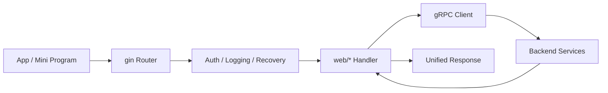

# 华师匣子BFF结构

## 定位

`bff` 是华师匣子面向 App 的统一网关层，对外提供 HTTP 接口，对内聚合多个 gRPC 微服务。

它不是简单的请求转发器，而是承担了以下职责：

- 统一前端入口，屏蔽底层服务拆分细节
- 负责鉴权、参数适配、响应结构统一
- 聚合多个后端服务的结果，输出面向页面和交互的接口
- 承担少量与用户体验直接相关的预热、异步触发逻辑

## 技术特征

- HTTP 框架使用 `gin`
- 服务间调用直接使用 gRPC client
- 依赖注入使用 `Google Wire`
- 错误处理和响应格式通过项目内封装统一
- 部分通用能力沉淀在自研 `pkg` 中

## 目录结构

```text
bff/
├── conf/                     # 配置加载与解析
├── config/                   # 配置文件
├── cron/                     # 定时任务
├── docs/                     # 文档与接口说明
├── errs/                     # 领域错误定义
├── ioc/                      # Wire provider 定义
├── pkg/
│   ├── errorx/               # 自定义错误封装
│   └── ginx/                 # Gin 适配与通用包装
├── web/                      # HTTP handler 与路由组织
│   ├── class/                # 课程相关接口
│   ├── classroom/            # 教室相关接口
│   ├── content/              # 首页内容、banner 等
│   ├── elecprice/            # 电费查询
│   ├── feed/                 # 消息与通知
│   ├── grade/                # 成绩查询
│   ├── health/               # 健康检查
│   ├── ijwt/                 # JWT 相关能力
│   ├── library/              # 图书馆能力
│   ├── metrics/              # 指标暴露
│   ├── middleware/           # Gin 中间件
│   ├── swag/                 # Swagger 相关内容
│   ├── tube/                 # 业务模块
│   ├── types.go              # 统一响应结构
│   └── user/                 # 用户相关接口
├── main.go                   # 进程入口
├── wire.go                   # Wire provider 定义
└── wire_gen.go               # Wire 生成代码
```

## 分层理解

可以把 BFF 内部再理解成三层：

| 层次 | 位置 | 作用 |
|------|------|------|
| 入口层 | `main.go`、`web/middleware` | 初始化 HTTP 服务、接入中间件、建立请求上下文 |
| 接口层 | `web/*` | 定义面向前端的 handler，完成参数绑定、鉴权、结果组装 |
| 支撑层 | `ioc`、`pkg`、`errs`、`config` | 完成依赖注入、配置加载、错误封装与公共能力复用 |

与普通后端服务不同，BFF 的核心不在领域建模，而在接口适配和聚合。

## 请求处理模式

典型请求链路如下：



一个 handler 通常会完成以下工作：

1. 从 `gin.Context` 读取参数和用户信息
2. 调用一个或多个 gRPC client
3. 将底层服务返回的数据转换为前端需要的字段结构
4. 将错误映射为统一响应格式

## 典型职责

### 1. 统一响应格式

`web/types.go` 定义了统一响应结构，BFF 负责把不同后端服务的返回结果整理成一致的 HTTP 输出。这一层隔离了前端与底层 gRPC 协议之间的直接耦合。

### 2. 鉴权与上下文透传

`web/ijwt` 和 `web/middleware` 负责处理用户身份信息。handler 在进入业务逻辑前即可拿到解析后的用户 claims，避免每个接口重复做认证逻辑。

### 3. 多服务聚合

`web` 下的各业务目录通常对应前端的一个领域页面，而不是严格一一对应某个微服务。BFF 可以在一个接口中组合多个下游服务结果，形成前端直接可用的数据结构。

### 4. 用户体验优化

部分接口会顺手触发异步预热逻辑，例如在首页内容请求中预先拉取 cookie 或成绩相关数据，目的是缩短用户后续操作的等待时间。

## 代码特征观察

### `content` 模块的预热逻辑

`GetBanners` 在返回首页 banner 的同时，异步触发用户 cookie 获取与计数写入：

```go
go func() {
    reqCtx := ctx.Request.Context()
    _, _ = h.userClient.GetCookie(reqCtx, &userv1.GetCookieRequest{StudentId: uc.StudentId})
    _, _ = h.counterClient.AddCounter(reqCtx, &counterv1.AddCounterReq{StudentId: uc.StudentId})
}()
```

这个实现说明 BFF 不只是“拼接口”，还会在靠近用户入口的位置做预加载和轻量编排。

### 自研封装较多

例如 `ginx`、`errorx` 这类包，本质上是在标准库或第三方库之上再包一层，形成项目自己的接口风格。这样做的收益是：

- handler 写法更统一
- 错误码和返回格式更容易收口
- 可以把团队约定沉淀成框架能力

代价是需要额外理解这些封装，而不能只按原生 Gin 用法阅读代码。

## 与整体架构的关系

- 对外：BFF 是前端唯一入口
- 对内：BFF 依赖多个 gRPC 微服务，但不直接承载核心业务数据存储
- 在职责边界上：BFF 更接近“接口编排层”，而不是独立业务域服务

如果要继续深入阅读，建议优先按下面顺序：

1. `main.go`：看服务如何启动、路由如何注册
2. `wire.go` / `ioc`：看依赖如何装配
3. `web/types.go`、`middleware`：看统一响应和鉴权模型
4. `web/content`、`web/grade` 等具体模块：看 handler 如何调用下游服务

## 跨主题链接

- [[华师匣子]] — 项目总览
- [[华师匣子框架]] — 整体微服务架构
- [[华师匣子-代码结构]] — 仓库与服务布局
