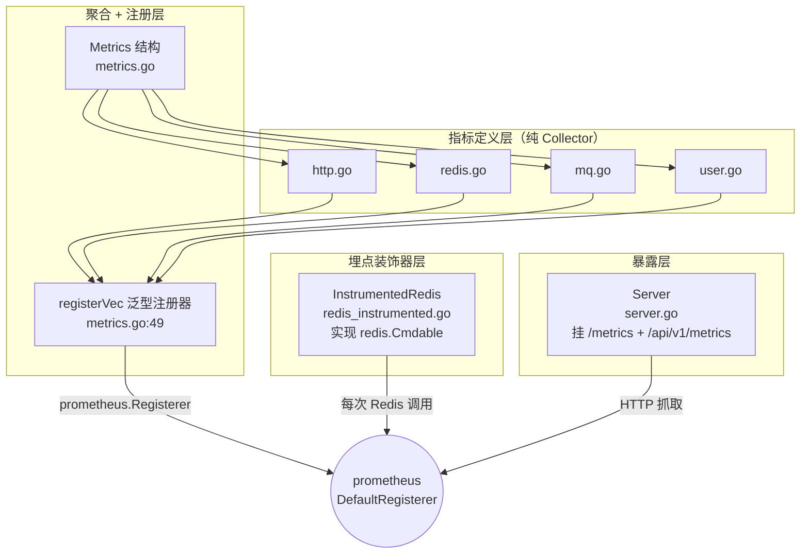

# 华师匣子指标中间件实现

> **适用模块**：`common/pkg/metricsx`  
> **相关笔记**：[[华师匣子]] · [[华师匣子框架]] · [[go-kratos 中间件实现]] · [[华师匣子日志封装]] · [[华师匣子限流中间件]] · [[BFF Otel使用]] · [[BFF OTel实践与排障]] · [[BFF DAU实现]] · [[BFF DAU验证与运维]] · [[可观测性]] · [[整体gRPC 配置字段]]

## 目录

1. [目录结构](#1-目录结构)
2. [整体架构](#2-整体架构)
3. [文件逐个拆解](#3-文件逐个拆解)
   - 3.1 [`metrics.go` — 顶层聚合](#31-metricsgo--顶层聚合)
   - 3.2 [`http.go` — HTTP 指标](#32-httpgo--http-指标)
   - 3.3 [`redis.go` — Redis 指标](#33-redisgo--redis-指标)
   - 3.4 [`redis_instrumented.go` — Redis 客户端埋点](#34-redis_instrumentedgo--redis-客户端埋点)
   - 3.5 [`mq.go` — 消息队列指标](#35-mqgo--消息队列指标)
   - 3.6 [`user.go` — DAU 指标](#36-usergo--dau-指标)
   - 3.7 [`server.go` — Metrics HTTP Server](#37-servergo--metrics-http-server)
   - 3.8 [`metrics_test.go` — 单元测试](#38-metrics_testgo--单元测试)
4. [潜在问题](#4-潜在问题)
5. [调用方概览](#5-调用方概览)
6. [总结与建议](#6-总结与建议)

## 1. 目录结构

```text
common/pkg/metricsx/
├── metrics.go                  # 顶层 Metrics 聚合 + 注册器管理
├── http.go                     # HTTP 监控指标定义
├── redis.go                    # Redis 监控指标定义
├── redis_instrumented.go       # Redis 客户端埋点装饰器（实现 redis.Cmdable）
├── mq.go                       # 消息队列监控指标定义
├── user.go                     # 用户行为指标（目前只有 DAU Gauge）
├── server.go                   # metrics HTTP 服务（/metrics 端点）
└── metrics_test.go             # 注册复用测试
```

## 2. 整体架构

包内职责分成三层：



> [!tip] 三层职责
> - **定义层**：只声明指标和标签，无业务逻辑。
> - **聚合层**：把同类指标装进结构体，统一注册到 `prometheus.Registerer`。
> - **埋点层**：装饰业务对象（Redis client），自动上报。
> - **暴露层**：HTTP 端点让 Prometheus 抓取（参考 [[可观测性]] 三大支柱中的 Metrics）。

## 3. 文件逐个拆解

### 3.1 `metrics.go` — 顶层聚合

#### 3.1.1 `Metrics` 聚合结构 `metrics.go:10-15`

```go
type Metrics struct {
    HTTP      *HTTPMetrics
    Redis     *RedisMetrics
    MQMetrics *MQMetrics
    User      *UserMetrics
}
```

把四类指标聚合成一个对象，方便依赖注入。命名上 `HTTP / Redis / MQMetrics` 不统一（三个缩写加 Metrics 后缀，一个直接用 User），`metrics.go:10-15` 没有刻意对齐。

#### 3.1.2 注册入口 `metrics.go:19-45`

```go
func New(namespace string) *Metrics {                                          // L19
    return NewWithRegisterer(prometheus.DefaultRegisterer, namespace)          // L20
}

func NewWithRegisterer(reg prometheus.Registerer, namespace string) *Metrics {  // L25
    m := &Metrics{
        HTTP:      newHTTPMetrics(namespace),
        Redis:     newRedisMetrics(namespace),
        MQMetrics: newMQMetrics(namespace),
        User:      newUserMetrics(namespace),
    }

    m.HTTP.RequestsTotal      = registerVec(reg, m.HTTP.RequestsTotal)
    m.HTTP.Duration           = registerVec(reg, m.HTTP.Duration)
    m.HTTP.ActiveConnections  = registerVec(reg, m.HTTP.ActiveConnections)
    m.Redis.RequestsTotal     = registerVec(reg, m.Redis.RequestsTotal)
    m.Redis.ErrorsTotal       = registerVec(reg, m.Redis.ErrorsTotal)
    m.Redis.Duration          = registerVec(reg, m.Redis.Duration)
    m.MQMetrics.ProducedTotal = registerVec(reg, m.MQMetrics.ProducedTotal)
    m.MQMetrics.ConsumedTotal = registerVec(reg, m.MQMetrics.ConsumedTotal)
    m.MQMetrics.FailedTotal   = registerVec(reg, m.MQMetrics.FailedTotal)
    m.User.DAU                = registerVec(reg, m.User.DAU)

    return m
}
```

- `New` 走 `prometheus.DefaultRegisterer`，生产用。
- `NewWithRegisterer` 接受自定义 registerer，用于测试或想隔离多个 registry 的场景。
- 注释 `metrics.go:18` 提示：**测试或自定义 registerer 场景请用 `NewWithRegisterer`**，避免污染默认全局。
- 所有 10 个 Collector 都通过 `registerVec` 注册，一次写完不漏。

#### 3.1.3 复用注册 `metrics.go:49-60`

```go
func registerVec[T prometheus.Collector](reg prometheus.Registerer, c T) T {  // L49
    if err := reg.Register(c); err != nil {                                   // L50
        var alreadyRegistered prometheus.AlreadyRegisteredError
        if errors.As(err, &alreadyRegistered) {                                // L52
            if existing, ok := alreadyRegistered.ExistingCollector.(T); ok {   // L53
                return existing                                                // L54
            }
        }
        panic(err)                                                             // L57
    }
    return c                                                                  // L59
}
```

设计要点：

- **泛型 `T prometheus.Collector`**（`metrics.go:49`）：编译期保留具体类型，调用方拿到的是 `*CounterVec` / `HistogramVec` / `Gauge`，不需要再次断言。
- **已注册则复用**（`metrics.go:53-55`）：用 `errors.As` 拿到 `AlreadyRegisteredError`，断言 `ExistingCollector` 是 `T`，是则返回；否则 panic。
- **其他错误一律 panic**（`metrics.go:57`）：Register 在重名/类型不匹配等情况下都会报错，这里统一 panic 暴露。

> [!note] 设计意图
> 注释 `metrics.go:24` 说"避免重复注册 panic"，所以做了 AlreadyRegistered 兜底。这与 [[go-kratos 中间件实现]] 中"装饰器 + 全局单例"的容错思想类似。

### 3.2 `http.go` — HTTP 指标

```go
type HTTPMetrics struct {                                                     // L8
    RequestsTotal     *prometheus.CounterVec
    Duration          *prometheus.HistogramVec
    ActiveConnections *prometheus.GaugeVec
}

func newHTTPMetrics(namespace string) *HTTPMetrics {                          // L14
    return &HTTPMetrics{
        RequestsTotal: prometheus.NewCounterVec(                              // L16
            prometheus.CounterOpts{
                Namespace: namespace, Name: "http_requests_total",
                Help: "Total HTTP requests",
            },
            []string{"method", "endpoint", "status"},                         // L22
        ),
        Duration: prometheus.NewHistogramVec(                                 // L24
            prometheus.HistogramOpts{
                Namespace: namespace, Name: "http_request_duration_seconds",
                Help: "HTTP request duration",
                Buckets:   prometheus.DefBuckets,                              // L29
            },
            []string{"endpoint", "status"},                                   // L31
        ),
        ActiveConnections: prometheus.NewGaugeVec(                            // L33
            prometheus.GaugeOpts{
                Namespace: namespace, Name: "http_active_connections",
                Help: "Active HTTP connections",
            },
            []string{"endpoint"},                                             // L39
        ),
    }
}
```

| 指标 | 类型 | 标签 | 含义 |
|------|------|------|------|
| `http_requests_total` | Counter | method / endpoint / status | 总请求数 |
| `http_request_duration_seconds` | Histogram (DefBuckets) | endpoint / status | 耗时分布 |
| `http_active_connections` | Gauge | endpoint | 当前在途连接数 |

> [!warning] Duration 缺 method 标签
> 注意 `RequestsTotal` 标签含 `method`，`Duration` 不含 —— 同一个 endpoint 不同方法的耗时也只共享一个 histogram，无法按 method 切片（详见 [§4 问题 3](#问题-3中危httpduration-缺-method-标签)）。

### 3.3 `redis.go` — Redis 指标

```go
type RedisMetrics struct {                                                    // L8
    RequestsTotal *prometheus.CounterVec
    ErrorsTotal   *prometheus.CounterVec
    Duration      *prometheus.HistogramVec
}
```

| 指标 | 类型 | 标签 | 含义 |
|------|------|------|------|
| `redis_requests_total` | Counter | operation / status | 总调用数 |
| `redis_errors_total` | Counter | operation / error_type | 错误数（独立于 status） |
| `redis_duration_seconds` | Histogram (DefBuckets) | operation | 耗时分布 |

> [!tip] 错误独立计数
> `ErrorsTotal` 拆出独立的 `error_type` 标签，便于按 `timeout / canceled / redis_error` 分类告警，与 [[华师匣子日志封装]] 中的错误日志分类保持一致。

### 3.4 `redis_instrumented.go` — Redis 客户端埋点

#### 3.4.1 装饰器结构 `redis_instrumented.go:11-21`

```go
type InstrumentedRedis struct {                                        // L11
    redis.Cmdable
    metrics *Metrics
}

func NewInstrumentedRedis(cmd redis.Cmdable, metrics *Metrics) *InstrumentedRedis {  // L16
    return &InstrumentedRedis{ Cmdable: cmd, metrics: metrics }
}
```

- 嵌入 `redis.Cmdable` 接口，转发所有未显式重写的方法。
- `var _ redis.Cmdable = (*InstrumentedRedis)(nil)`（`redis_instrumented.go:244`）编译期断言满足接口。

#### 3.4.2 统一观测函数 `redis_instrumented.go:23-31`

```go
func (r *InstrumentedRedis) observeOperation(operation string, duration time.Duration, err error) {
    status := "OK"
    if err != nil && !errors.Is(err, redis.Nil) {                            // L25
        status = "Error"
        r.metrics.Redis.ErrorsTotal.WithLabelValues(operation, classifyRedisError(err)).Inc()
    }
    r.metrics.Redis.RequestsTotal.WithLabelValues(operation, status).Inc()   // L29
    r.metrics.Redis.Duration.WithLabelValues(operation).Observe(duration.Seconds())
}
```

每个 Redis 方法的固定三步走：

1. **错误分类**（`L25-28`）：不是 `redis.Nil`（业务上的"键不存在"是常态，不算错）就标记为 `Error` 并独立计数。
2. **总计数**（`L29`）：`RequestsTotal` 区分 `OK / Error`。
3. **耗时**（`L30`）：无论成功失败都打 histogram。

#### 3.4.3 错误分类 `redis_instrumented.go:33-41`

```go
func classifyRedisError(err error) string {                                  // L33
    if errors.Is(err, context.DeadlineExceeded) { return "timeout" }
    if errors.Is(err, context.Canceled)       { return "canceled" }
    return "redis_error"
}
```

把 `error_type` 收敛成三类： `timeout / canceled / redis_error`（详见 [§4 问题 6](#问题-6中危classifyrediserror-错误分类过粗)）。

#### 3.4.4 30+ 手工包装方法

`redis_instrumented.go:43-230` 全部都是同一个模板：

```go
func (r *InstrumentedRedis) Get(ctx context.Context, key string) *redis.StringCmd {   // L50
    start := time.Now()
    cmd := r.Cmdable.Get(ctx, key)
    r.observeOperation("GET", time.Since(start), cmd.Err())
    return cmd
}
```

覆盖：PFAdd / Get / Set / SetNX / HGet / HSet / HGetAll / MGet / MSet / Del / Exists / Expire / Incr / Decr / IncrBy / DecrBy / Append / GetSet / SMembers / SAdd / SRem / SIsMember / SCard / TTL / Type / Keys / Ping。

> [!warning] 手写易漏
> `PFCount` 没有显式包装 —— `bff/web/middleware/prometheus.go:88` 在 `recordDAU` 中调用 `m.redisClient.PFCount(ctx, dayKey)`，这个调用会走嵌入的 `redis.Cmdable` 默认方法，**没有埋点**。详见 [[BFF DAU实现]] 中对埋点覆盖的讨论，以及 [§4 问题 2/4](#问题-4中危redis_instrumentedgo-30-重复方法靠手写)。

#### 3.4.5 未埋点的部分 `redis_instrumented.go:232-242`

```go
// Pipeline 返回的 pipeline 暂时直接透传, 不会对 pipeline 内部的命令做埋点。
// 已知限制: 使用 Pipeline 的链路（批量 MSET/MGET 等）目前不会出现在 ccnubox_redis_* 指标里。
// TODO: 实现一个 instrumentedPipeliner, 在 Exec() 时统一上报整体耗时和错误数。
func (r *InstrumentedRedis) Pipeline() redis.Pipeliner {
    return r.Cmdable.Pipeline()
}
```

`Pipeline()` 和 `TxPipeline()` 透传，**整个 pipeline 没有任何埋点**。生产中批量 Redis 操作（`MGET` 在 `be-ccnu/service` 等大量使用）在 ccnubox_redis_* 指标里完全看不到。

### 3.5 `mq.go` — 消息队列指标

```go
type MQMetrics struct {                                                      // L8
    ProducedTotal *prometheus.CounterVec
    ConsumedTotal *prometheus.CounterVec
    FailedTotal   *prometheus.CounterVec
}
```

| 指标 | 类型 | 标签 | 含义 |
|------|------|------|------|
| `mq_produced_total` | Counter | topic / status | 生产消息数 |
| `mq_consumed_total` | Counter | topic / status | 消费消息数 |
| `mq_failed_total` | Counter | topic / error_type | 处理失败数 |

> [!note] 无 Duration
> **没有 Duration / Histogram**。Sarama 的生产者/消费者埋点在业务模块里实现，本包只提供指标定义。`be-feed/events/producer/producter.go:79` 和 `be-grade/events/producer/producter.go:79` 的 `NewInstrumentedSaramaProducer` 注释一致，实现都在业务包内。

### 3.6 `user.go` — DAU 指标

```go
type UserMetrics struct {                                                    // L7
    DAU prometheus.Gauge
}

func newUserMetrics(namespace string) *UserMetrics {                         // L11
    return &UserMetrics{
        DAU: prometheus.NewGauge(prometheus.GaugeOpts{
            Name: prometheus.BuildFQName(namespace, "", "dau"),              // L14
            Help: "Daily active users (unique StudentId per day, finalized at 00:05 local).",
        }),
    }
}
```

特殊点： `Name` 字段用 `BuildFQName(namespace, "", "dau")`（`user.go:14`）手工拼全名；其他三个文件都是把 `namespace` 塞到 `Namespace` 字段（由 prometheus 内部拼接）。效果一样，但写法不统一。

> [!warning] 注释与实现不一致
> 注释 `user.go:6-7` 写："由 cron 任务在每天 00:05 写入昨天的最终值"。但实际从 `bff/web/middleware/prometheus.go:96` 看，**每次请求都会 `m.metrics.User.DAU.Set(float64(count))`**，并不是 00:05 一次性写。详见 [[BFF DAU实现]] 与 [§4 问题 2](#问题-2中危dau-gauge-在每次请求都被-set)。

### 3.7 `server.go` — Metrics HTTP Server

#### 3.7.1 端口派生 `server.go:17, 35-51`

```go
const metricsPortOffset = 1000                                               // L17

func NewServerFromGRPCAddr(grpcAddr string) *Server {                        // L35
    return NewServer(DeriveAddr(grpcAddr))
}

func DeriveAddr(grpcAddr string) string {                                    // L41
    host, port, err := net.SplitHostPort(grpcAddr)
    if err != nil { return ":29090" }                                        // L44 fallback
    p, err := strconv.Atoi(port)
    if err != nil { return ":29090" }                                        // L48
    return net.JoinHostPort(host, strconv.Itoa(p+metricsPortOffset))         // L50
}
```

约定：**metrics 端口 = gRPC 端口 + 1000**，避免 yaml 单独配置。例如 gRPC 监听 `:29084`，metrics 监听 `:30084`。与 [[整体gRPC 配置字段]] 中的服务端口约定保持一致。

> [!warning] fallback 冲突
> `grpcAddr` 解析失败 fallback 到 `:29090` —— 多服务部署在同一台机时，如果多个服务 gRPC 配置都异常，**会全部回落到 29090 冲突**。详见 [§4 问题 11](#问题-11低deriveaddr-fallback-冲突)。

#### 3.7.2 `Serve` 启动 `server.go:61-94`

```go
func (s *Server) Serve() error {                                             // L61
    if s == nil || s.addr == "" { return nil }                               // L62

    handler := promhttp.Handler()                                            // L66
    mux := http.NewServeMux()
    mux.Handle("/metrics", handler)                                          // L70
    mux.Handle("/api/v1/metrics", handler)                                   // L71

    server := &http.Server{
        Addr:    s.addr,
        Handler: mux,
        ReadHeaderTimeout: 5 * time.Second,                                  // L80
        ReadTimeout:       10 * time.Second,
        WriteTimeout:      10 * time.Second,
        IdleTimeout:       60 * time.Second,
    }

    s.mu.Lock()
    s.server = server                                                        // L87
    s.mu.Unlock()

    if err := server.ListenAndServe(); err != nil && !errors.Is(err, http.ErrServerClosed) {
        return err
    }
    return nil
}
```

- 同时挂 `/metrics`（社区惯例）和 `/api/v1/metrics`（与 bff 路由风格一致）。
- 注释 `server.go:73-74` 显式说：**无鉴权，依赖内网信任**。
- `server.go:80-83` 紧超时：`ReadHeaderTimeout=5s`，适合 metrics 这种轻量只读端点。
- `ListenAndServe` 在 `http.ErrServerClosed` 时正常返回（关闭后），其他错误返回。

#### 3.7.3 `Close` 关闭 `server.go:96-110`

```go
func (s *Server) Close() error {                                             // L96
    if s == nil { return nil }                                               // L97

    s.mu.Lock()
    server := s.server
    s.mu.Unlock()                                                            // L103
    if server == nil { return nil }                                          // L104

    ctx, cancel := context.WithTimeout(context.Background(), 5*time.Second)
    defer cancel()
    return server.Shutdown(ctx)                                              // L110
}
```

- `s.server` 是 `nil` 时直接返回 —— 也就是说**先 `Close` 后 `Serve` 不会 panic**，但也**不会启动任何东西**。
- 5s 优雅关闭，超时由 ctx 强制。与 [[cron 关闭兜底]] / [[gRPCx的封装#2-2-4-close-优雅关闭--grpc_servergo77]] 的优雅停机思路一致。

### 3.8 `metrics_test.go` — 单元测试

只有 3 个测试，集中在注册复用：

| 测试 | 验证点 |
|------|--------|
| `TestNewWithRegistererReusesAlreadyRegisteredCollectors` | 同 registry 两次 `NewWithRegisterer` 返回同一 Counter / Histogram 实例 |
| `TestNewUsesDefaultRegisterer` | `New` 走 `DefaultRegisterer`，字段非空 |
| `TestNewWithRegistererInitializesUserMetrics` | `User.DAU` 初始化，描述符含 `ccnubox_test_dau` |

> [!warning] 测试覆盖不足
> **没有 `InstrumentedRedis` 的测试**（`metrics_test.go` 整个文件只测了注册逻辑），`observeOperation` 的行为（分类、超时识别、Nil 排除）靠人工推导。详见 [§4 问题 8](#问题-8低缺-instrumentedredis-的单元测试)。

## 4. 潜在问题

> 严重度图例：**[高]**（可能 panic / 监控盲区）· **[中]**（行为异常 / 静默退化）· **[低]**（代码风格 / 可疑）

### 问题 1（中危）：`Pipeline / TxPipeline` 整条命令不埋点

`redis_instrumented.go:232-242` 显式承认：

```go
// 已知限制: 使用 Pipeline 的链路（批量 MSET/MGET 等）目前不会出现在 ccnubox_redis_* 指标里。
// TODO: 实现一个 instrumentedPipeliner, 在 Exec() 时统一上报整体耗时和错误数。
```

实际影响：

- `bff/web/middleware/prometheus.go:88` 的 `PFCount` 调用**也没埋点**（因为 `InstrumentedRedis` 没有 `PFCount` 显式包装，会走嵌入 `redis.Cmdable` 默认方法）。
- 任何走 `Pipeline()` 的批量操作在 metrics 上完全"消失"，从监控上无法察觉 Pipeline 性能问题。

**修复**：实现 `instrumentedPipeliner` 包装 `redis.Pipeliner`，在 `Exec()` 时整体上报；`PFCount` 等常用但未包装的方法补上。

### 问题 2（中危）：DAU Gauge 在每次请求都被 Set

`user.go:6-7` 注释：

```go
// DAU 是一个无标签 Gauge, 由 cron 任务在每天 00:05 写入"昨天"的最终值
```

但 `bff/web/middleware/prometheus.go:96`：

```go
m.metrics.User.DAU.Set(float64(count))
```

这是**每次 HTTP 请求结束后都写一次 Gauge**，不是 00:05 cron 写。后果：

- Gauge 在一天内不断"跳动"，反映的是"截至上一次请求时，Redis 里的 PV 估算"，而不是日活。
- 配合 HyperLogLog 的误差，数值会带噪声。
- 注释和实现不一致，后续维护者按注释会以为是 cron 写。

参见 [[BFF DAU实现]] 中对写入时机的讨论，以及 [[BFF DAU验证与运维]] 中的排障说明。

**修复**：要么把 Gauge 写入收敛到 cron，要么改注释。

### 问题 3（中危）：`http.Duration` 缺 `method` 标签

`http.go:31`：

```go
[]string{"endpoint", "status"},
```

`RequestsTotal` 含 `method / endpoint / status`，`Duration` 只含 `endpoint / status`。

- 同一个 endpoint 下 `GET /api/foo` 和 `POST /api/foo` 共用同一个 histogram，无法按 method 切片分析 P99 延迟。
- 工程上 method 对延迟影响很大（GET 通常快，POST 慢），不放进 histogram 会丢失诊断精度。

**修复**：把 `method` 加进 Duration 标签。

### 问题 4（中危）：`redis_instrumented.go` 30+ 重复方法靠手写

`redis_instrumented.go:43-230` 几乎全部是同一模板：

```go
start := time.Now()
cmd := r.Cmdable.Xxx(ctx, ...)
r.observeOperation("XXX", time.Since(start), cmd.Err())
return cmd
```

问题：

- 任何新增 Redis 方法都要在 244 行文件里再加一段包装，容易漏。
- `PFCount`（`bff/web/middleware/prometheus.go:88` 实际用了）就**漏了**，埋点彻底消失。
- 重构工具如 `go generate` + 模板，或者用 `redis.Hook` 机制（`go-redis` 提供 `AddHook`/`ProcessHook`），都比手写更好。

**修复**：`go-redis` 提供 `redis.Hook` 接口（包含 `DialHook` / `ProcessHook` 等），在 `NewInstrumentedRedis` 里 `cmd.AddHook(hook)` 一次就能覆盖所有命令，无需枚举。

### 问题 5（中危）：`Server` 重复 Serve 会泄露

`server.go:61-94` `Serve`：

```go
s.mu.Lock()
s.server = server
s.mu.Unlock()
if err := server.ListenAndServe(); ...
```

- 多次调用 `Serve` 会**覆盖** `s.server`，旧的 HTTP server 没有 `Shutdown` 直接被抛弃，goroutine 泄露。
- 当前使用模式都是 `Serve` 一次然后 `Close`，但接口层没禁止重复调用。

**修复**：`Serve` 开头加 `if s.server != nil { return errors.New("server already running") }`。

### 问题 6（中危）：`classifyRedisError` 错误分类过粗

`redis_instrumented.go:33-41`：

```go
func classifyRedisError(err error) string {
    if errors.Is(err, context.DeadlineExceeded) { return "timeout" }
    if errors.Is(err, context.Canceled)       { return "canceled" }
    return "redis_error"
}
```

- 所有非超时/非取消的错误都打成 `redis_error` 一个值。
- `redis.Nil` 已经提前排除（`redis_instrumented.go:25` `!errors.Is(err, redis.Nil)`）。
- 但 `go-redis` 的 `MaxRetries` 已经 retry 完，网络错误、连接拒绝、cluster 路由失败等具体类型都被压平成 `redis_error`，排查时缺少信息。

**修复**：用 `errors.As` 区分 `*net.OpError` / `redis.ErrClosed` / `*redis.Error` 等具体类型，或者至少区分 `connection / protocol / other` 三类。

### 问题 7（低）：`registerVec` 重复注册时类型不匹配直接 panic

`metrics.go:49-60`：

```go
if existing, ok := alreadyRegistered.ExistingCollector.(T); ok {
    return existing
}
panic(err)  // ← 类型不匹配也走这里
```

- 注释 `metrics.go:24` 说"已注册则复用"，但 `ExistingCollector` 类型不是 `T` 时（比如同 namespace 之前注册过一个同名 `CounterVec`，现在想注册 `GaugeVec`）会 panic。
- 实际生产中不会发生（本包不重名），但作为通用注册器不够稳。

**修复**：对类型不匹配的情况返回有意义的 error 而不是 panic。

### 问题 8（低）：缺 `InstrumentedRedis` 的单元测试

`metrics_test.go:1-61` 只测了注册复用，`observeOperation` 的关键行为（错误分类、`redis.Nil` 不计错、timeout 识别）都没测试。

- 这是埋点的核心，测试覆盖不足，后续改 `classifyRedisError` 时容易回归。

**修复**：用 `prometheus.NewRegistry()` + 模拟 Cmdable 写 `TestObserveOperation` / `TestClassifyRedisError`。

### 问题 9（低）：`Metrics` 字段命名不统一

`metrics.go:10-15`：

```go
type Metrics struct {
    HTTP      *HTTPMetrics
    Redis     *RedisMetrics
    MQMetrics *MQMetrics   // ← 多了 "Metrics" 后缀
    User      *UserMetrics // ← 多了 "Metrics" 后缀
}
```

- `HTTP` / `Redis` 短，`MQMetrics` / `User` 长。
- 不影响功能但读起来不一致。

**修复**：统一为 `HTTP / Redis / MQ / User`，或都加 `Metrics` 后缀。

### 问题 10（低）：`/metrics` 端点无鉴权

`server.go:73-74` 注释自承：

```go
// 注意: gRPC 服务的 metrics 端点目前无鉴权, 依赖"集群内网可信任"的部署模型。
// 如果未来需要暴露到公网/办公网, 应在 mux 外面套一层 basic auth 或 IP allowlist 中间件。
```

生产环境如果 K8s Service 配错或 NPort 暴露，任何人都能拉取 QPS、错误率、DAU 等数据。详见注释里给出的方案。

### 问题 11（低）：`DeriveAddr` fallback 冲突

`server.go:42-50`：

```go
host, port, err := net.SplitHostPort(grpcAddr)
if err != nil { return ":29090" }
p, err := strconv.Atoi(port)
if err != nil { return ":29090" }
```

- gRPC addr 解析失败时所有服务都回落到 `:29090`。
- 单机部署多服务（开发环境常见）会全部冲突，metrics 抓取混乱。

**修复**：fallback 加 `os.Getpid()` 或 host 名后缀，如 `:29090-<pid>`；或者直接 panic 暴露配置错误。

### 问题 12（低）：Histogram 全部用 `DefBuckets`

`http.go:29` `redis.go:37` 都用 `prometheus.DefBuckets` = `[.005, .01, .025, .05, .1, .25, .5, 1, 2.5, 5, 10]`（秒）。

- HTTP 端到端延迟通常 5ms ~ 5s，DefBuckets 合适。
- Redis 单操作通常 0.1ms ~ 50ms，DefBuckets 太粗，绝大部分请求都落在 0.005s 桶以下，分位数算不准。

**修复**：Redis 用 `[0.0001, 0.0005, 0.001, 0.005, 0.01, 0.05, 0.1, 0.5, 1]` 这种更细的桶。

## 5. 调用方概览

| 业务模块 | 用途 |
|----------|------|
| `bff/web/middleware/prometheus.go` | gin 中间件，打 HTTP 指标 + DAU |
| `bff/ioc/redis.go:15` | `RedisCmdable` 用 `NewInstrumentedRedis` 包装 |
| `be-feed/ioc/metrics.go` | 初始化 `Metrics` + `Server` |
| `be-feed/events/feedEventConsumer.go:27` | Kafka consumer 用 `MQMetrics` |
| `be-feed/events/producer/producter.go:79` | Sarama producer 埋点 |
| `be-grade/.../gradeEventConsumer.go:25` | 同 feed，消费消息 |
| `be-classlist_v2/ioc/metrics.go` | 同 feed 模式 |

> 与 [[BFF DAU实现]] / [[BFF DAU验证与运维]] 配合理解 DAU 链路，与 [[BFF Otel使用]] 配合理解 Metrics × Tracing 串联。

## 6. 总结与建议

| 维度 | 评价 |
|------|------|
| 指标设计 | 标准 Counter / Histogram / Gauge，标签设计基本合理 |
| 注册复用 | 泛型 + AlreadyRegisteredError 兜底，==优雅== |
| Redis 埋点 | 30+ 方法手写包装，**易漏**（`PFCount` 已漏） |
| Pipeline 埋点 | **缺失**，官方 TODO 承认 |
| HTTP 端点 | 简洁，但无鉴权，依赖内网信任 |
| DAU | 注释与实现不一致，每次请求写 Gauge |
| 测试覆盖 | 仅注册复用测试，埋点核心行为无测试 |

**优先建议**：

1. **改用 `redis.Hook` 替代 30+ 手写方法**：`redis_instrumented.go` 重构，`PFCount` 漏埋点问题一并解决。
2. **实现 Pipeline 埋点**：`redis_instrumented.go:232-242` 的 TODO 落地，否则生产批量操作在监控上消失。
3. **修 DAU 实现 / 注释**：`user.go:6-7` 与 `bff/web/middleware/prometheus.go:96` 不一致，任一调整。
4. **补 `Duration.method` 标签**：`http.go:31` 把 method 加进 histogram 标签。
5. **细化 Redis 错误分类**：`redis_instrumented.go:33-41` 区分 connection / protocol 等。
6. **为 InstrumentedRedis 补单元测试**：`metrics_test.go` 只测注册，埋点核心行为未覆盖。

## 跨主题链接

- [[华师匣子]] — 项目总览
- [[华师匣子框架]] — Wire DI / Kratos 风格
- [[go-kratos 中间件实现]] — 同模块的"装饰器 + 中间件链"思想
- [[华师匣子日志封装]] — 与本模块的 trace_id 串联方式相同
- [[华师匣子限流中间件]] — 限流指标的暴露方式
- [[BFF Otel使用]] — OTel 与 Metrics 的串联
- [[BFF OTel实践与排障]] — 排障时 Metrics + Trace 配合
- [[BFF DAU实现]] — DAU Gauge 的写入实现
- [[BFF DAU验证与运维]] — DAU 指标排障
- [[可观测性]] — Metrics / Logs / Traces 三大支柱
- [[整体gRPC 配置字段]] — gRPC 端口与 metrics 端口派生关系
- [[cron 关闭兜底]] — 优雅停机相关
- [[pitfalls]] — 通用工程陷阱清单
