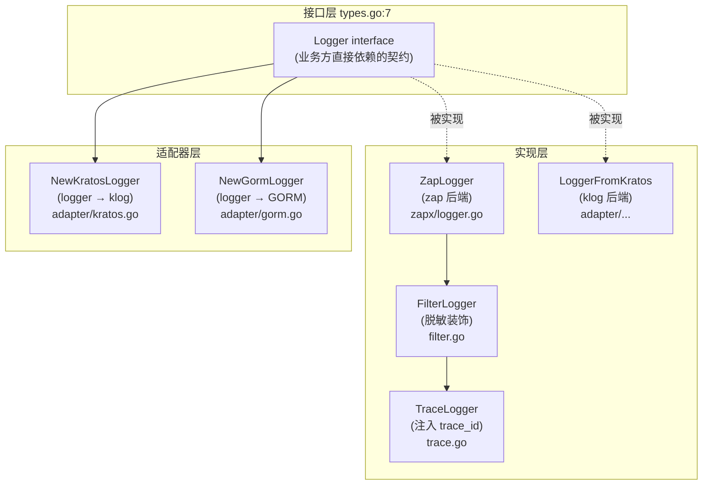

# 华师匣子日志封装

> **适用模块**：`common/pkg/logger`  
> **相关笔记**：[[华师匣子]] · [[华师匣子框架]] · [[go-kratos 中间件实现]] · [[BFF logger中间件的问题]] · [[BFF Otel使用]] · [[BFF OTel实践与排障]] · [[gopay xlog Kratos 日志桥接]] · [[可观测性]]

## 目录

1. [目录结构](#1-目录结构)
2. [整体架构](#2-整体架构)
3. [文件逐个拆解](#3-文件逐个拆解)
   - 3.1 [`types.go` — 核心接口](#31-typesgo--核心接口)
   - 3.2 [`level.go` — 级别枚举](#32-levelgo--级别枚举)
   - 3.3 [`context.go` — ctx 传递 + 全局单例](#33-contextgo--ctx-传递--全局单例)
   - 3.4 [`filter.go` — 敏感信息脱敏装饰器](#34-filtergo--敏感信息脱敏装饰器)
   - 3.5 [`trace.go` — OpenTelemetry 链路装饰器](#35-tracego--opentelemetry-链路装饰器)
   - 3.6 [`zapx/logger.go` — zap 后端实现](#36-zapxloggergo--zap-后端实现)
   - 3.7 [`adapter/kratos.go` — Kratos 适配器](#37-adapterkratosgo--kratos-适配器)
   - 3.8 [`adapter/kratos_to_logger.go` — Kratos 反向适配器](#38-adapterkratos_to_loggergo--kratos-反向适配器)
   - 3.9 [`adapter/gorm.go` — GORM 适配器](#39-adaptergormgo--gorm-适配器)
4. [潜在问题](#4-潜在问题)
5. [典型使用方式](#5-典型使用方式)
6. [总结与建议](#6-总结与建议)

## 1. 目录结构

```text
common/pkg/logger/
├── types.go                    # 统一接口 + Field 辅助构造器
├── level.go                    # 日志级别枚举
├── context.go                  # ctx 传递 logger + 全局单例
├── filter.go                   # 敏感信息脱敏装饰器
├── trace.go                    # OpenTelemetry 链路信息装饰器
├── zapx/
│   └── logger.go               # zap 后端的具体实现
└── adapter/
    ├── kratos.go               # 自定义 logger → Kratos logger (klog.Logger)
    ├── kratos_to_logger.go     # Kratos logger → 自定义 logger
    └── gorm.go                 # 自定义 logger → GORM logger.Interface
```

## 2. 整体架构

包的设计采用**装饰器模式 + 适配器模式**，层次分明：



> [!tip] 装饰器与适配器
> - **装饰器**（`FilterLogger` / `TraceLogger`）= 同接口包一层，叠加能力。
> - **适配器**（`adapter/*`）= 异构接口转同接口，把外部框架接到我们的 `Logger` 上。
>
> 二者组合后业务侧只看到同一份 `logger.Logger` 契约，下层后端（zap）和上层框架（Kratos / GORM）解耦。

## 3. 文件逐个拆解

### 3.1 `types.go` — 核心接口

```go
// types.go:7
type Logger interface {
    WithContext(ctx context.Context) Logger
    With(args ...Field) Logger

    Debug(msg string, args ...Field)
    Info(msg string, args ...Field)
    Warn(msg string, args ...Field)
    Error(msg string, args ...Field)

    Debugf(template string, args ...interface{})
    Infof(template string, args ...interface{})
    Warnf(template string, args ...interface{})
    Errorf(template string, args ...interface{})

    AddCallerSkip(skip int) Logger
}
```

设计要点：

| 方法 | 作用 | 备注 |
|------|------|------|
| `WithContext(ctx)` | 把 ctx 关联到 logger，后续 `addTraceInfo` 时读 trace | 装饰器要保留 ctx 链 |
| `With(args...)` | 注入固定字段（如 `scope=kratos`） | 业务侧常用于附加 request_id |
| `Debug/Info/Warn/Error` | 结构化日志，Field 形式 | 主流结构化日志库风格 |
| `Debugf/.../Errorf` | printf 风格 | 先 `fmt.Sprintf` 再调结构化版本 |
| `AddCallerSkip` | 调整 caller 栈帧，让日志里的文件名/行号指向真正调用方 | 装饰器嵌套时必须透传 |

`Field` 是一个极简 KV（`types.go:24-27`），配套辅助构造器在 `types.go:29-69`：

| 构造器 | 用途 |
|--------|------|
| `Any(k, v)` | 通用 |
| `Error(err)` | 自动 key="error" |
| `String/Int/Int32/Int64(k, v)` | 类型化 |
| `Bool/Float64/Duration` | ==缺失==，需要用 `Any` 包 |

### 3.2 `level.go` — 级别枚举

```go
// level.go:3-25
type Level int
const (
    DEBUG Level = iota
    INFO
    WARN
    ERROR
)
```

简单 `iota` 整数枚举 + `String()` 方法。**未提供** `ParseLevel` / `UnmarshalText`，配置文件里写字符串时无法直接反序列化到 `Level`。

### 3.3 `context.go` — ctx 传递 + 全局单例

#### 3.3.1 全局单例 `context.go:13-17`

```go
var GlobalLogger Logger

func InitGlobalLogger(logger Logger) {
    GlobalLogger = logger
}
```

`context.go:9-10` 有 TODO 注释：

```text
TODO(classlist-v2): keep this compatibility layer until v1 services finish
migrating to constructor-injected logger.Logger, then delete this file.
```

> [!warning] 计划删除
> **未来要删除** —— `classlist/cmd/classlist/main.go:82` 等老服务还在用，新服务（`be-ccnu` 等）已经全部用 wire 注入（参见 [[go-kratos 中间件实现]] 中关于 DI 的设计）。

#### 3.3.2 ctx 传递 `context.go:19-36`

```go
type LoggerCtxKey struct{}

func WithLogger(ctx context.Context, Logger Logger) context.Context {
    return context.WithValue(ctx, LoggerCtxKey{}, Logger)
}

func GetLoggerFromCtx(ctx context.Context) Logger {
    ctxLogger, ok := ctx.Value(LoggerCtxKey{}).(Logger)
    if !ok || ctxLogger == nil {
        log.Error("get logger from context failed, using default logger")
        if GlobalLogger != nil {
            return GlobalLogger
        }
        panic("Global logger is not initialized. Call InitGlobalLogger first.")
    }
    return ctxLogger
}
```

- 用空 struct 类型 `LoggerCtxKey` 作为 key，防止和别的 ctx value 冲突。
- `GetLoggerFromCtx` 拿不到时**先尝试 `GlobalLogger`**，再 panic —— 行为偏激进，生产环境没有初始化就会直接挂掉。

#### 3.3.3 `From` 工厂 `context.go:42-46`

```go
func From(ctx context.Context) Logger {
    if l := GetLoggerFromCtx(ctx); l != nil {
        return l
    }
    return GlobalLogger.WithContext(ctx)
}
```

业务层入口。优先用 ctx 里已注入的 logger，否则用全局 logger 重新包一层 ctx（供后续 trace_id 注入）。

> [!note] 设计动机
> 注释 `context.go:38-41` 解释：上层注入后，后继链路要从 ctx 里取**已被修饰过的 logger**（带 trace_id 等），不能直接用 GlobalLogger。

### 3.4 `filter.go` — 敏感信息脱敏装饰器

#### 3.4.1 三种过滤规则 `filter.go:10-32`

```go
const fuzzyStr = "***"                                         // L8

type FilterOptions func(*FilterLogger)

func FilterKey(keys ...string) FilterOptions                  // L12
func FilterValue(value ...string) FilterOptions               // L20
func FilterFunc(f func(level, key, val) (string, bool)) FilterOptions  // L28
```

| 选项 | 作用 | 示例 |
|------|------|------|
| `FilterKey("password", "token")` | **整 key** 命中就脱敏 | `logger.String("token", "abc")` → `token=***` |
| `FilterValue("secret123")` | **值精确匹配** 命中就脱敏 | `logger.String("name", "secret123")` → `name=***` |
| `FilterFunc(fn)` | 自定义函数，可改写值（不是固定 `***`） | `password:"123"` → `password:"***"` |

#### 3.4.2 核心过滤逻辑 `filter.go:54-94`

```go
func (f *FilterLogger) filter(level Level, fields []Field) []Field {   // L54
    if len(fields) == 0 { return fields }
    out := make([]Field, 0, len(fields))
    for _, field := range fields {
        if fuzzy, ok := f.shouldFilter(level, field); ok {              // L61
            out = append(out, Field{Key: field.Key, Val: fuzzy})
            continue
        }
        out = append(out, field)
    }
    return out
}

func (f *FilterLogger) shouldFilter(level Level, field Field) (string, bool) {  // L74
    if _, ok := f.filterKeys[field.Key]; ok { return fuzzyStr, true }   // L75

    if v, ok := stringify(field.Val); ok {                              // L79
        if _, hit := f.filterVals[v]; hit { return fuzzyStr, true }     // L80
        if len(f.filterFuncSlice) > 0 {                                 // L84
            for _, fn := range f.filterFuncSlice {
                if newFuzzyStr, shouldFuzzy := fn(level, field.Key, v); shouldFuzzy {
                    return newFuzzyStr, true
                }
            }
        }
    }
    return "", false
}

func stringify(val any) (string, bool) {                                // L96
    switch v := val.(type) {
    case string: return v, true
    case fmt.Stringer: return v.String(), true
    default: return "", false
    }
}
```

过滤优先级：

1. key 命中 `filterKeys` → 固定 `***`
2. value 字符串化后命中 `filterVals` → 固定 `***`
3. value 字符串化后过所有 `filterFuncSlice` → 自定义改写（可返回原值或新值）
4. 都不命中 → 原样放行

> [!warning] `stringify` 覆盖面窄
> `stringify`（`filter.go:96`）只支持 `string` 和 `fmt.Stringer`；`int` / `struct{}` / `[]byte` 等无法触发 `FilterValue` 和 `FilterFunc`，只能通过 `FilterKey` 整 key 过滤。

#### 3.4.3 透传 `filter.go:107-167`

`WithContext` / `With` / `AddCallerSkip` 三个装饰器方法都要**重新包一层 `FilterLogger`**，把内部 logger 调用对应方法，并把过滤配置（`filterKeys` / `filterVals` / `filterFuncSlice`）整体复制 —— 保证装饰链不断。

#### 3.4.4 实际业务使用 `be-ccnu/ioc/log.go:18-37`

```go
func InitLogger(cfg *conf.ServerConf) logger.Logger {
    res := log.InitLogger(cfg.Log, 4)
    return logger.NewFilterLogger(res,
        logger.FilterFunc(func(level logger.Level, key, val string) (string, bool) {
            if !strings.Contains(val, "password") { return val, false }
            masked := passwordReg.ReplaceAllString(val, `$1***$3`)         // password:"xxx"
            masked = passwordSQLReg.ReplaceAllString(masked, `$1***$3`)   // `password`='xxx'
            return masked, true
        }),
    )
}
```

典型用法：用 `FilterFunc` 对 value 做正则替换 —— `password:"xxx"` → `password:"***"`，SQL 里的 `` `password`='xxx' `` → 同样脱敏。

### 3.5 `trace.go` — OpenTelemetry 链路装饰器

#### 3.5.1 行为 `trace.go:21-39`

```go
type TraceLogger struct {
    logger Logger
    ctx    context.Context
    level  Level
}

func NewTraceLogger(logger Logger, opts ...TraceOptions) Logger {     // L27
    l := &TraceLogger{
        logger: logger,
        ctx:    context.Background(),
        level:  ERROR,                                                // L31 默认只报 ERROR
    }
    ...
}
```

- 默认 `level=ERROR`，**只有 ERROR 级别**会主动调 OTel `span.RecordError` / `span.SetStatus`。
- 任何级别都会向日志字段自动追加 `trace_id` 和 `span_id`。

#### 3.5.2 日志方法 `trace.go:65-99`

```go
func (f *TraceLogger) Error(msg string, args ...Field) {
    f.reportTraceInfo(ERROR, msg)            // L93
    f.logger.Error(msg, f.addTraceInfo(args)...)
}
```

每个级别都先 `reportTraceInfo` 再 `addTraceInfo`。

#### 3.5.3 OTel Span 上报 `trace.go:101-113`

```go
func (f *TraceLogger) reportTraceInfo(level Level, msg string) {
    span := trace.SpanFromContext(f.ctx)

    if span.SpanContext().IsValid() && level >= f.level {       // L105
        span.RecordError(errors.New(msg))                       // L106
        if level >= ERROR {
            span.SetStatus(codes.Error, msg)                    // L108
        } else {
            span.SetStatus(codes.Ok, msg)                       // L110
        }
    }
}
```

行为矩阵：

| 级别 | 满足 `level >= ERROR` | 行为 |
|------|-----------------------|------|
| DEBUG/INFO/WARN | 否 | `recordError` + `SetStatus(Ok, msg)` |
| ERROR | 是 | `recordError` + `SetStatus(Error, msg)` |

> [!warning] 语义错误
> WARN 也调 `SetStatus(Ok, msg)` 是有问题的 —— WARN 是异常情况，但被标记为 Ok，会让 trace 上看不出有问题。详见 [§4 问题 3](#问题-3中危tracego107-111-warn-也标记-setstatusok--语义错误)。

#### 3.5.4 日志注入 trace_id `trace.go:116-126`

```go
func (f *TraceLogger) addTraceInfo(fields []Field) []Field {
    span := trace.SpanFromContext(f.ctx)
    if span.SpanContext().IsValid() {
        fields = append(fields,
            String("trace_id", span.SpanContext().TraceID().String()),
            String("span_id",  span.SpanContext().SpanID().String()),
        )
    }
    return fields
}
```

只要 ctx 里有有效 span，日志里就带 `trace_id` / `span_id`，关联链路追踪。配合 [[BFF Otel使用]] 中的 OTel 接入，trace 能串起整个请求链路。

### 3.6 `zapx/logger.go` — zap 后端实现

#### 3.6.1 结构与构造 `zapx/logger.go:12-22`

```go
type ZapLogger struct {
    l   *zap.Logger
    ctx context.Context
}

func NewZapLogger(l *zap.Logger) logger.Logger {
    return &ZapLogger{l: l, ctx: context.Background()}
}
```

#### 3.6.2 通用 log 方法 `zapx/logger.go:81-96`

```go
func (z *ZapLogger) log(level zapcore.Level, msg string, args ...logger.Field) {
    zapFields := z.toArgs(args)
    switch level {
    case zapcore.DebugLevel: z.l.Debug(msg, zapFields...)
    case zapcore.InfoLevel:  z.l.Info(msg, zapFields...)
    case zapcore.WarnLevel:  z.l.Warn(msg, zapFields...)
    case zapcore.ErrorLevel: z.l.Error(msg, zapFields...)
    default:                 z.l.Info(msg, zapFields...)   // 兜底走 Info
    }
}
```

`zapx/logger.go:98-104` 的 `toArgs` 把 `[]logger.Field` 简单转成 `[]zap.Field`：

```go
func (z *ZapLogger) toArgs(args []logger.Field) []zap.Field {
    res := make([]zap.Field, 0, len(args))
    for _, arg := range args {
        res = append(res, zap.Any(arg.Key, arg.Val))  // 全部用 zap.Any
    }
    return res
}
```

> [!note] 性能权衡
> 全部走 `zap.Any` 会损失类型化字段的性能优势（int / string 等可以走 `zap.Int` / `zap.String` 走更快的编码路径）。**性能略损**但灵活性高。

#### 3.6.3 生产环境 Encoder `zapx/logger.go:106-116`

```go
func ProdEncoderConfig() zapcore.EncoderConfig {
    return zapcore.EncoderConfig{
        TimeKey:      "@timestamp",                          // ELK 友好
        LevelKey:     "level",
        MessageKey:   "msg",
        CallerKey:    "caller",
        EncodeLevel:  zapcore.CapitalLevelEncoder,           // INFO / DEBUG
        EncodeTime:   zapcore.ISO8601TimeEncoder,            // 2006-01-02T15:04:05.000Z0700
        EncodeCaller: zapcore.ShortCallerEncoder,            // 短路径: pkg/file.go:42
    }
}
```

#### 3.6.4 实际初始化 `common/bizpkg/log/log.go:14-43`

```go
func InitLogger(cfg *conf.LogConf, skip int) logger.Logger {
    lumberjackLogger := &lumberjack.Logger{
        Filename:   cfg.Path,
        MaxSize:    cfg.MaxSize, MaxBackups: cfg.MaxBackups, MaxAge: cfg.MaxAge,
        Compress:   cfg.Compress,
    }
    core := zapcore.NewCore(
        zapcore.NewJSONEncoder(zapx.ProdEncoderConfig()),
        zapcore.NewMultiWriteSyncer(
            zapcore.AddSync(lumberjackLogger),               // 写文件
            zapcore.AddSync(os.Stdout),                       // 同时输出 stdout
        ),
        zapcore.DebugLevel,                                  // 全收
    )
    l := zap.New(core, zap.AddCaller(), zap.AddStacktrace(zap.ErrorLevel), zap.AddCallerSkip(skip))
    res := zapx.NewZapLogger(l)
    res = logger.NewTraceLogger(res, logger.TraceLevel(logger.ERROR))  // 默认 ERROR 才上报
    return res
}
```

完整调用链：**zap 写文件 + stdout → zapx 包装 → TraceLogger（自动注入 trace_id + ERROR 上报 span）→ 业务方**。

### 3.7 `adapter/kratos.go` — Kratos 适配器

```go
func NewKratosLogger(l logger.Logger) klog.Logger {                         // L16
    return &KratosLogger{
        l: l.With(logger.String("scope", "kratos")).AddCallerSkip(3),        // L18
    }
}

func (k *KratosLogger) Log(level klog.Level, keyvals ...any) error {         // L22
    fields := make([]logger.Field, 0, len(keyvals)/2)
    var msg string
    for i := 0; i < len(keyvals); i += 2 {                                   // L26
        key := fmt.Sprint(keyvals[i])
        var val any
        if i+1 < len(keyvals) { val = keyvals[i+1] }
        if key == "msg" || key == "message" {                                // L33
            msg = fmt.Sprint(val)
            continue
        }
        fields = append(fields, logger.Any(key, val))
    }

    switch level {
    case klog.LevelDebug: k.l.Debug(msg, fields...)
    case klog.LevelInfo:  k.l.Info(msg, fields...)
    case klog.LevelWarn:  k.l.Warn(msg, fields...)
    case klog.LevelError: k.l.Error(msg, fields...)
    case klog.LevelFatal: k.l.Error(msg, fields...)                          // L50: Fatal 走 Error
    default:              k.l.Info(msg, fields...)
    }
    return nil
}
```

要点：

- Kratos 的 `klog.Logger` 是 `Log(level, keyvals ...any) error` 这种 KV 形式（`adapter/kratos.go:22`）。
- `adapter/kratos.go:33` 把 `msg` / `message` 字段提取出来作为日志消息，其余做 Field。
- `adapter/kratos.go:50` Kratos 的 `LevelFatal` 被映射为 `Error`（Kratos Fatal 实际是 `os.Exit(1)`，这里没复刻）。
- 包装时固定加 `scope=kratos`（`adapter/kratos.go:18`），`AddCallerSkip(3)` 是因为 Kratos 调用栈比直接调用多 3 层。
- 给 Kratos gRPC / HTTP server 注入，让框架自身的日志走我们的 logger。

> 同类实现的对比可参考 [[gopay xlog Kratos 日志桥接]]（同样是把三方 logger 桥接到 Kratos 的 `klog`）。

### 3.8 `adapter/kratos_to_logger.go` — Kratos 反向适配器

反向适配器，用于业务代码里**只能用 Kratos logger**（比如拿不到 wire 注入的 logger）的场景。

```go
func (k *LoggerFromKratos) Debug(msg string, args ...logger.Field) {         // L44
    klog.NewHelper(k.l).WithContext(k.ctx).Debugw(k.keyvals(msg, args...)...)
}
```

`klog.NewHelper(...).Debugw(keyvals...)` 是 Kratos 推荐的用法。`AddCallerSkip` 是 no-op（`kratos_to_logger.go:76-78`），因为 Kratos 的 Helper 已经做了 skip。

### 3.9 `adapter/gorm.go` — GORM 适配器

实现 `gorm.io/gorm/logger.Interface`，把 SQL 日志接到我们的 logger 上。

#### 3.9.1 构造与并发安全 `adapter/gorm.go:20-33`

```go
func NewGormLogger(l logger.Logger) *GormLogger {
    return &GormLogger{
        l:             l.With(logger.String("scope", "gorm")).AddCallerSkip(2),
        SlowThreshold: 200 * time.Millisecond,                                // L23 默认 200ms
        LogLevel:      glog.Warn,                                              // L24 默认只 Warn+
    }
}

func (g *GormLogger) LogMode(level glog.LogLevel) glog.Interface {            // L29
    newLogger := *g                                                          // 值拷贝
    newLogger.LogLevel = level
    return &newLogger                                                         // 返回新指针
}
```

`LogMode` 是 GORM 切换日志级别用的，实现上是**值拷贝 + 返回新指针**（`adapter/gorm.go:30-32`），保证并发安全。

#### 3.9.2 SQL 追踪核心 `adapter/gorm.go:63-93`

```go
func (g *GormLogger) Trace(ctx context.Context, begin time.Time, fc func() (string, int64), err error) {
    if g.LogLevel <= glog.Silent { return }                                  // L64

    elapsed := time.Since(begin)
    sql, rows := fc()                                                        // L69 真正执行 SQL 回调拿结果

    fields := []logger.Field{
        logger.String("sql", sql),
        logger.Int64("rows", rows),
        logger.String("duration", elapsed.String()),
    }

    l := g.l.WithContext(ctx)

    switch {
    case err != nil && g.LogLevel >= glog.Error && !errors.Is(err, gorm.ErrRecordNotFound):
        l.Error("mysql_error", append(fields, logger.Error(err))...)         // L83

    case elapsed > g.SlowThreshold && g.SlowThreshold != 0 && g.LogLevel >= glog.Warn:
        slowLogMsg := fmt.Sprintf("slow_sql >= %v", g.SlowThreshold)
        l.Warn(slowLogMsg, fields...)                                         // L88

    case g.LogLevel == glog.Info:
        l.Info("mysql_query", fields...)                                      // L92
    }
}
```

行为矩阵：

| 条件 | 级别 | 消息 | 备注 |
|------|------|------|------|
| 错误 && 非 ErrRecordNotFound | Error | `mysql_error` | 业务上"查不到"不算错 |
| 慢 SQL（默认 200ms） | Warn | `slow_sql >= 200ms` | 字段含 sql/rows/duration |
| LogLevel=Info | Info | `mysql_query` | 完整 SQL |
| LogLevel=Silent | — | — | 静默 |

## 4. 潜在问题

> 严重度图例：**[高]**（可能 panic / 资源泄露 / 安全绕过）· **[中]**（行为异常 / 静默退化）· **[低]**（代码风格 / 可疑）

### 问题 1（中危）：`zapx/logger.go:101` 全部用 `zap.Any` 性能略损

```go
res = append(res, zap.Any(arg.Key, arg.Val))
```

`zap.Any` 走反射判断类型，比 `zap.String` / `zap.Int` 等慢一个量级。`types.go:43-69` 已经为 `String/Int/Int32/Int64` 提供了构造器，可以在 `toArgs` 里根据 `Field.Val` 的实际类型分发到对应的 `zap.Xxx`，减少反射开销。

### 问题 2（中危）：`context.go:33-34` panic 行为过于激进

```go
if GlobalLogger != nil {
    return GlobalLogger
}
panic("Global logger is not initialized. Call InitGlobalLogger first.")
```

如果新服务忘了 `InitGlobalLogger`（且 ctx 里也没注入），`GetLoggerFromCtx` 会直接 panic。考虑到这是基建方法，建议：

- 退化为返回一个 noop logger（`Debug` 等全部空实现）；
- 或者在 wire 编译期就强制注入（已有 wire 的话问题不大，但老服务还有这个全局依赖）。

### 问题 3（中危）：`trace.go:107-111` WARN 也标记 `SetStatus(Ok, ...)` 语义错误

```go
if level >= ERROR {
    span.SetStatus(codes.Error, msg)
} else {
    span.SetStatus(codes.Ok, msg)   // WARN/INFO/DEBUG 都被打 Ok
}
```

WARN 通常代表"业务异常但未失败"，但被标记为 `Ok` 会让 trace UI 上看不出问题。建议：

- DEBUG/INFO 不调 `SetStatus`（保持 Span 默认 Unset）；
- WARN 也不调 `SetStatus` 或单独用一个 `SpanEvent` 标记；
- 仅 ERROR 设 `Error`。

同时 `trace.go:106` 任何级别都 `span.RecordError(errors.New(msg))` 也有问题 —— RecordError 应该只用于错误，WARN 调 RecordError 会让 trace 上看到"Error event"误报。相关讨论见 [[BFF OTel实践与排障]]。

### 问题 4（中危）：`filter.go:96-105` `stringify` 覆盖面太窄

```go
func stringify(val any) (string, bool) {
    switch v := val.(type) {
    case string: return v, true
    case fmt.Stringer: return v.String(), true
    default: return "", false
    }
}
```

`int` / `int64` / `bool` / `[]byte` / 任何 struct 都不支持。结果：

- `logger.Int("password", 123)` → 因为不是 string，不会触发 `FilterValue` / `FilterFunc`，只能靠 `FilterKey("password")` 整 key 脱敏。
- `[]byte` 类型的日志值根本不会被脱敏，需要调用方先转 string。

### 问题 5（高危）：`filter.go:132-145` `*f` 系列空 format 直接走 `f.Debug(fmt.Sprintf(...))`

```go
func (f *FilterLogger) Debugf(template string, args ...interface{}) {
    f.Debug(fmt.Sprintf(template, args...))
}
```

格式化后的字符串既不是 Field，也无法被 `FilterFunc` 处理（因为已经拼成 msg，msg 不过滤）。如果业务方习惯：

```go
log.Debugf("login failed for user %s with password %s", user, password)
```

`password` 会被**拼到 msg 里原样输出**，绕过 `FilterFunc` 脱敏（因为 `FilterFunc` 只看 Field 的 val，不看 msg）。

目前仓库中没有敏感信息使用`XXXf`的方法，但还是建议改掉。

> [!error] 高危
> 该路径会泄露密码 / Token 等敏感字段，**必须修复或文档化禁用**。

**修复建议**：在 `Debugf/Infof/...` 内对 template 做预扫描，识别 `With` 里要插入的 Field（类似 logrus 的 `WithFields`）；或者直接禁掉 `*f` 风格，要求业务方用结构化 Field。

> 同类问题在 [[BFF logger中间件的问题]] 中也有讨论（header 全量打印等泄露场景）。

### 问题 6（低）：`level.go` 没有 `ParseLevel` / `UnmarshalText`

配置文件里通常写 `"info" / "debug"`，但 `Level` 只有 `String()` 没有 `UnmarshalText` / `ParseLevel`，配置文件反序列化到 `Level` 字段时会报错。需要 `log.NewFilterLogger(res, logger.Level(...))` 时也只能传 `logger.INFO` 整数，不够友好。

### 问题 7（低）：`adapter/kratos.go:50` `LevelFatal` 映射为 `Error`

Kratos 的 `LevelFatal` 实际会 `os.Exit(1)`，这里只 `Error` 不退出。如果某个 Kratos 中间件触发 Fatal，期望进程退出，实际只打了一条 Error 日志，行为不一致。

### 问题 8（低）：`context.go:9-10` TODO 注释承诺删除全局单例

```go
// TODO(classlist-v2): keep this compatibility layer until v1 services finish
// migrating to constructor-injected logger.Logger, then delete this file.
```

但 `be-classlist/cmd/classlist/main.go:82` 还在 `mlog.InitGlobalLogger(logger)`，迁移完成度参差。建议明确迁移截止日期 / issue 跟踪。

### 问题 9（低）：`filter.go:149` `With` 用 `INFO` 级别过滤

```go
func (f *FilterLogger) With(args ...Field) Logger {
    filteredArgs := f.filter(INFO, args)
    ...
}
```

`With` 注入的字段固定按 `INFO` 级别过滤。但 `With` 出来的 logger 后续可能用于 `Debug` / `Error` 等不同级别，如果 `FilterFunc` 的实现对 `level` 敏感（WARN 字段不脱敏之类），会出现 "With 时 INFO 脱敏，后续用 Error 打印却不解密" 这种诡异行为。建议 `With` 不过滤，或者把过滤推迟到 `Debug/Info/...` 调用时。

### 问题 10（低）：`adapter/gorm.go:20-26` `SlowThreshold=0` 含义歧义

```go
case elapsed > g.SlowThreshold && g.SlowThreshold != 0 && g.LogLevel >= glog.Warn
```

`SlowThreshold != 0` 才认为有慢查询阈值，设成 0 表示禁用慢查询。这与直觉（0 表示无限）相反，容易误用。建议改成 `< 0` 表示禁用，或显式 `SlowThresholdEnabled bool` 开关。

## 5. 典型使用方式

```go
// 1. 业务方：从 ctx 取 logger（优先）或用全局
log := logger.From(ctx)
log.Info("user login",
    logger.String("user_id", uid),
    logger.String("ip", ip),
)

// 2. 给一段链路加固定字段
reqLog := log.With(logger.String("request_id", reqID))
reqLog.Info("step 1")
reqLog.Info("step 2")

// 3. 初始化（在 main / wire 里）
func InitLogger(cfg *conf.ServerConf) logger.Logger {
    res := log.InitLogger(cfg.Log, 4)
    res = logger.NewTraceLogger(res, logger.TraceLevel(logger.ERROR))
    res = logger.NewFilterLogger(res,
        logger.FilterKey("password", "token"),
        logger.FilterFunc(myCustomMask),
    )
    return res
}

// 4. 注入到 Kratos / GORM
kratosLog := adapter.NewKratosLogger(log)        // 给 Kratos 框架
gormLog   := adapter.NewGormLogger(log)          // 给 GORM
```

## 6. 总结与建议

| 维度 | 评价 |
|------|------|
| 接口设计 | 极简，装饰器模式清晰 |
| 装饰器（Filter / Trace） | 模式标准，但 `AddCallerSkip` 链路手工管理易错 |
| 后端实现（zap） | 稳定，但 `zap.Any` 全走反射略损性能 |
| 适配器（Kratos / GORM） | 覆盖主流三方 |
| 敏感信息脱敏 | Filter 体系完整，但 `*f` 格式化版本绕过脱敏（高危） |
| 链路追踪 | 自动注入 `trace_id` 好用，但 WARN 标记 Ok 语义错（中危） |
| ctx 传递 | 标准做法 |
| 全局单例 | 计划删除，迁移中 |

**优先建议**：

1. **修脱敏绕过**：`filter.go:132-145` 的 `*f` 方法会绕过 `FilterFunc`，应扫描 template 识别 Field，或文档化禁用。
2. **修 trace 语义**：`trace.go:107-111` WARN 标 Ok 错误，DEBUG/INFO 不该 RecordError。
3. **优化 zap 编码**：`zapx/logger.go:101` 用 `zap.Any` 走反射，可按 `Field.Val` 类型分发到 `zap.String/Int/...`。
4. **降级 panic**：`context.go:33` `GetLoggerFromCtx` 没有 logger 时应返回 noop，不要直接 panic。

## 跨主题链接

- [[华师匣子]] — 项目总览
- [[华师匣子框架]] — Wire DI / Kratos 风格
- [[go-kratos 中间件实现]] — 与本模块同样基于"装饰器 + 上下文注入"思想
- [[BFF logger中间件的问题]] — BFF 层 logger 的实战踩坑
- [[BFF Otel使用]] — OTel 全链路接入
- [[BFF OTel实践与排障]] — 链路语义与排障
- [[gopay xlog Kratos 日志桥接]] — 类似模式的另一实现
- [[可观测性]] — Logging / Tracing / Metrics 三件套总览
- [[pitfalls]] — 通用工程陷阱清单
