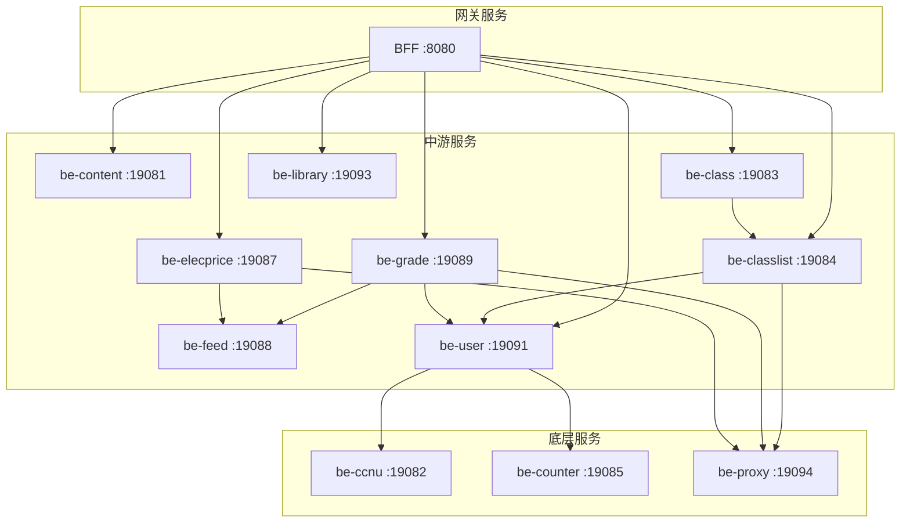

# 华师匣子框架

## 自研风格

> Google Wire 依赖注入 + 手写 Kratos 风格 gRPC + Gin BFF + etcd 注册中心 + Kafka 事件 + MySQL/Redis/Elasticsearch

整套架构由团队自研拼装，没有采用单一现成微服务框架。Wire 负责编译期 DI，Kratos 的 `conf / server / service / biz` 思想被借鉴但**不**使用其 cmd 入口与 transport 抽象，gRPC 走 `google.golang.org/grpc` 原生注册。

## 技术栈

| 组件 | 版本 | 用途 |
|------|------|------|
| Go | 1.26+ | 开发语言（`go.work` workspace 模式） |
| etcd | latest | 服务注册与发现 |
| MySQL | latest | 主存储 |
| Redis | latest | 缓存、分布式锁 |
| Kafka | latest | 异步消息 |
| Elasticsearch | 7.17.23 | 全文搜索 |
| OpenTelemetry | — | 分布式追踪、日志桥接 |

## 分层架构

仓库自述把服务划成 3 层，依赖方向自上而下：

- **BFF 层**：HTTP/8080 入口，聚合多个 gRPC 微服务，是面向小程序前端的唯一出口。
- **中游业务服务**：直接对 BFF 暴露能力，可能互相调用或依赖底层服务。
- **底层服务**：登录、IP 代理、用户判断等基础能力，被中游服务复用。

## 关键设计点

### 1. BFF 聚合层
- BFF/main.go 监听 HTTP/8080，对小程序前端暴露 REST 风格接口
- 内部把所有请求翻译成 gRPC 调用多个微服务
- 负责鉴权透传、字段裁剪、错误码统一，避免直接暴露底层 gRPC 契约

### 2. 依赖注入（Google Wire）
- 每个服务根目录有 `wire.go` 与生成的 `wire_gen.go`
- 编译期生成 provider 链，启动期 `wireApp(...)` 一次性构造对象图
- 团队风格上更接近 Kratos 的 `ProviderSet`，但**没有用** `ProviderSet` 命名，而是手写 `wire.NewSet(...)`

### 3. 服务发现
- etcd 集中注册
- 服务启动时把 `host:port` 写入 etcd key，gRPC client 通过 etcd resolver 解析
- 心跳由服务进程托管，不依赖外部 sidecar

### 4. 通信
- 服务间 gRPC（protobuf 定义集中在 `common/api`）
- BFF ↔ 前端 HTTP
- Kafka 用于跨服务异步事件（如 `be-feed` 订阅 `be-grade` 等业务信号）

### 5. 存储分层
- **MySQL**：业务主数据，按服务分库
- **Redis**：缓存、分布式锁、轻量计数
- **Elasticsearch**：需要全文检索的场景（feed、内容等）

### 6. 追踪
- 全链路 OpenTelemetry
- HTTP / gRPC middleware 透传 trace context，日志中带 `trace_id`

## 配置文件

每个服务目录下有两份配置模板：

| 文件 | 说明 |
|------|------|
| `config-example.yaml` | 业务配置（env, server, data, registry, log） |
| `config-infra-example.yaml` | 基础设施配置（MySQL/Redis/Kafka/etcd 连接） |

## 跨主题链接

- [[华师匣子]] — 项目 hub
- [[华师匣子-代码结构]] — 目录树、布局
- [[微服务]] — 微服务总览
- [[go-kratos架构]] — 借鉴的 Kratos 风格
- [[kratos layout]] — 单服务 layout 模板
