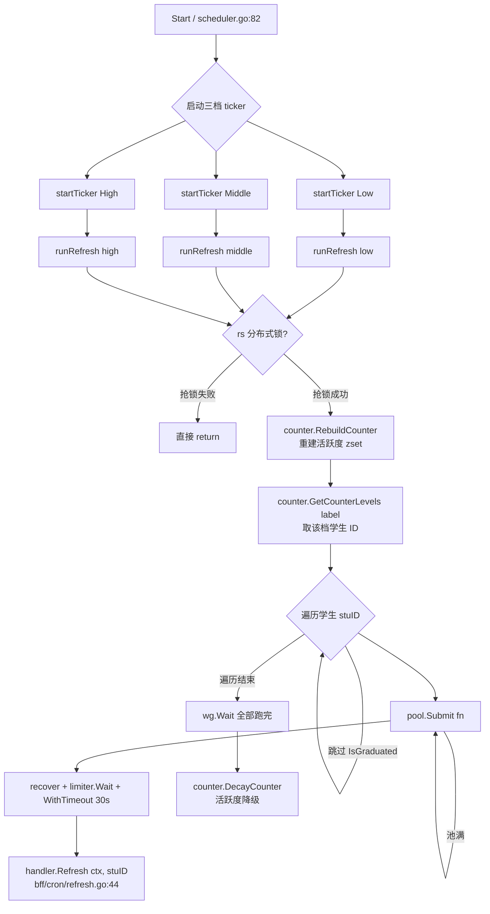

# `common/pkg/tieredx` 包详解

> 分层刷新调度器（Tiered Refresh Scheduler），按"活跃度"分档定时为海量学号刷新数据。

源码位于 `common/pkg/tieredx/scheduler.go`（全包仅此一个文件，共 195 行）。

模块所属项目总览见 [[华师匣子]]，框架与技术栈选型见 [[华师匣子框架]]，目录结构与构建约定见 [[华师匣子-代码结构]]。

---

## 1. 解决的问题

CCNUBox 后端会为每个登录学生维护一份"最新数据"（课表、成绩等），需要周期性从教务系统拉取，但：

- 学生数量可能成千上万，**全部按同一频率刷**会把教务系统打爆。
- 学生**活跃度差异大**：今天刚看过成绩的，10 分钟后还想再刷；半个月没登录的，几小时刷一次就够了。

`tieredx` 的做法是**按活跃度分 3 档（高/中/低）**，每档跑独立的 ticker，在档位周期内再通过**协程池 + 令牌桶**控制并发与节奏。档位由 `be-counter` 服务维护，周期结束自动衰减分数，实现动态滑档。

> [!info] 与 [[BFF DAU实现]] 的区别
> - [[BFF DAU实现]] 解决"**今天有多少人来过**"的统计需求，是**观测类**指标。
> - `tieredx` 解决"**最近活跃的人**如何被更快地刷新"的需求，是**调度类**机制。
> - 两者都依赖 `be-counter` 服务，但前者只读 `GetCounter`，后者会写 `RebuildCounter` / `DecayCounter`。

---

## 2. 文件总览

```text
common/pkg/tieredx/
└── scheduler.go     # 全部实现，195 行
```

`bff` 中通过 [[华师匣子BFF结构|BFF]] 的 `bff/ioc/scheduler.go:11` 注入，通过 `bff/main.go:37` 接入生命周期。

---

## 3. 核心数据结构

### 3.1 三个常量

```go
// common/pkg/tieredx/scheduler.go:18
const (
    qps      = 20    // 令牌桶限流：每秒最多 20 个任务
    PoolSize = 20    // ants 协程池大小：最多 20 个 goroutine 并发
)
```

两者相等，让"池容量"和"启动节奏"对齐（详见 § 5.5）。这一对齐在 § 5.5 的"双重并发控制"表格中再展开。

### 3.2 `RefreshHandler` 接口

```go
// common/pkg/tieredx/scheduler.go:24
type RefreshHandler interface {
    Refresh(ctx context.Context, studentId string) error
}
```

`scheduler` 不关心"怎么刷"，只调用这一个方法。业务侧在 `bff/cron/refresh.go:33` 通过 `NewTieredHandler` 注入，真正逻辑在 `bff/cron/refresh.go:44` 的 `Refresh`——它会调 grade、classlist、feed 等微服务。

### 3.3 `TieredConfig`

```go
// common/pkg/tieredx/scheduler.go:28
type TieredConfig struct {
    Low    int  // 低频档周期（分钟）
    Middle int  // 中频档周期（分钟）
    High   int  // 高频档周期（分钟）
}
```

来源：`bff/conf/conf.go:27` 的 `Tiered *TieredConf`，YAML 配置项 `tiered.low/middle/high`。YAML 字段命名与 § 5.5 的 QPS/池容量需**手动保持一致**——`tiered.high` 频率最高，需要更细的并发控制时同步调大 `qps` 和 `PoolSize`。

### 3.4 `TieredScheduler` 结构体

```go
// common/pkg/tieredx/scheduler.go:44
type TieredScheduler struct {
    cfg      TieredConfig
    handler  RefreshHandler                  // 业务刷新逻辑
    counter  counterv1.CounterServiceClient  // 用于查档位、降级、重建
    l        logger.Logger
    rs       *redsync.Redsync                // 分布式锁（可选）
    stopChan chan struct{}
    pool     *ants.Pool                      // 协程池
}
```

---

## 4. 构造函数

```go
// common/pkg/tieredx/scheduler.go:55
func NewTieredScheduler(
    cfg TieredConfig,
    handler RefreshHandler,
    counter counterv1.CounterServiceClient,
    l logger.Logger,
    opts ...Option,
) *TieredScheduler {
    pool, _ := ants.NewPool(
        PoolSize,
        ants.WithExpiryDuration(60*time.Second),  // 空闲 60s 回收 worker
        ants.WithNonblocking(false),              // 阻塞模式：池满时 Submit 阻塞等待
    )
    s := &TieredScheduler{ ... pool: pool }
    for _, opt := range opts {
        opt(s)
    }
    return s
}
```

`Option` 模式目前只提供一个：

```go
// common/pkg/tieredx/scheduler.go:37
func WithRedsync(rs *redsync.Redsync) Option {
    return func(s *TieredScheduler) { s.rs = rs }
}
```

被 `bff/ioc/scheduler.go:17` 调用，实现多实例互斥。`redsync` 的引入背景与 [[Redis]] 上的分布式锁模式一致。

---

## 5. `ants` 在本项目中的使用详解

`github.com/panjf2000/ants/v2` 是 Go 生态最常用的有界 goroutine 池。本包只用了**最核心的 5 个 API/选项**，但每一处都有具体作用。

### 5.1 为什么需要协程池？

每个 `runRefresh` 会从 counter 服务拿到**成百上千个学生 ID**。如果直接 `go handler.Refresh(ctx, stuID)`，会瞬间起几千个 goroutine：

- 每个 goroutine 默认栈 8 KB，加上 ctx、闭包，可能 16~32 KB；
- 几千个 → 几十 MB 内存，且 Go 调度器在大量 goroutine 上调度开销激增；
- 同时把下游（教务接口、counter 服务）打挂。

`ants.NewPool(20)` 把**同时运行的 goroutine 数硬上限**设为 20。这与 [[华师匣子限流中间件|业务侧限流中间件]] 思路一致——后者是入口处限流，`tieredx` 是后台任务侧的限流。

### 5.2 4 个关键配置/API

| # | 位置 | 作用 |
|---|------|------|
| 1 | `ants.NewPool(PoolSize)` `scheduler.go:63` | 创建容量为 20 的池 |
| 2 | `ants.WithExpiryDuration(60*time.Second)` `scheduler.go:64` | worker 空闲 60s 后自动回收 |
| 3 | `ants.WithNonblocking(false)` `scheduler.go:65` | **阻塞模式**：池满时 `Submit` 阻塞而不是丢弃 |
| 4 | `s.pool.Submit(func() {...})` `scheduler.go:148` | 投递任务到池 |
| 5 | `s.pool.Release()` `scheduler.go:194` | 进程退出时释放池 |

### 5.3 `WithNonblocking(false)` 阻塞模式——本包的关键选择

`ants` 提供两种 `Submit` 行为：

- **`WithNonblocking(true)`**：池满立即返回 `ErrPoolOverload`，调用方决定是否丢弃或重试。
- **`WithNonblocking(false)`**（本包选择）：池满时 `Submit` **阻塞**，直到有 worker 空闲再投递。

选择阻塞模式的原因写在 `scheduler.go:180` 的 `wg.Wait()`：

```go
for _, stuID := range stuIDs {
    wg.Add(1)
    err = s.pool.Submit(func() { ... })   // 池满就阻塞
    if err != nil {
        wg.Done()
        s.l.Errorf("pool submit task error:%v", err)
        continue
    }
}
wg.Wait()    // 必须等所有学生都处理完才能做 DecayCounter
```

> [!important] 业务契约
> "档内全部刷一遍"：所有学生处理完后还要调 `DecayCounter` 做活跃度降级。如果丢弃任务，会有学生永远不被刷；阻塞模式保证"全部跑完才返回"。

### 5.4 `WithExpiryDuration(60s)`——节省资源

```go
// common/pkg/tieredx/scheduler.go:64
ants.WithExpiryDuration(60*time.Second),
```

`runRefresh` 不会一直高频触发（每档周期都是分钟级），worker 经常空闲。开启后：

- worker 空闲超过 60s 自动退出；
- 下次有任务时再按需创建新 worker（最多仍为 20）；
- 在"夜间长空闲"场景下把 goroutine 数压到接近 0，显著降低内存。

### 5.5 双重并发控制：ants 池 + 令牌桶

`runRefresh` 里实际有**两层**并发控制（都在 `scheduler.go:136-178`）：

```go
limiter := rate.NewLimiter(rate.Limit(qps), qps)   // ① 令牌桶：20 QPS

for _, stuID := range stuIDs {
    wg.Add(1)
    err = s.pool.Submit(func() {                    // ② 协程池上限 20
        defer wg.Done()
        defer recover()                             // ③ panic 隔离
        err := limiter.Wait(ctx)                    // ① 取令牌
        if err != nil { return }
        ct, cancel := context.WithTimeout(ctx, 30*time.Second)  // ④ 单任务超时
        defer cancel()
        s.handler.Refresh(ct, stuID)                // 真正执行
    })
    ...
}
wg.Wait()
```

| 层级 | 数值 | 作用 |
|------|------|------|
| **ants 池** | 20 | 限制**同时运行**的 goroutine 数，防本机内存爆 |
| **令牌桶** `limiter.Wait` | 20 QPS，`qps` 常量 | 限制**启动速度**，防下游接口被瞬时打爆 |
| **`recover()`** | — | 单个任务 panic 不会杀掉 worker（关键：不会让池瘫痪） |
| **`context.WithTimeout(30s)`** | 30s | 单个刷新任务最长 30 秒，防卡死 |
| **`tool.IsGraduated(stuID)`** `scheduler.go:143` | — | 跳过毕业学生，纯字符串判断 |

> [!tip] QPS 与 goroutine 数对齐的设计
> `qps == PoolSize == 20` 不是巧合：当 worker 数与令牌生成速率相等时，池子近似"稳态运行"——既不会让池长期空转，也不会让令牌堆积成"未来某刻集中执行"的尖峰。微调其中之一都应同步另一个。

### 5.6 完整执行流程图



> [!note] 降级是关键
> 每个周期结束后，所有学生的"活跃度分数"衰减，导致不活跃的学生从"高频档"滑落到"中/低频档"，自动形成分层。
> 该机制与 [[BFF DAU实现|DAU 统计]] 的写入路径相互独立，但都依赖 `be-counter` 服务，因此可以观察两侧指标交叉验证。

---

## 6. 项目中的接入方式

### 6.1 配置：`bff/conf/conf.go`

```go
// bff/conf/conf.go:27
Tiered *TieredConf `yaml:"tiered"`

// bff/conf/conf.go:77
type TieredConf struct {
    Low    int `yaml:"low"`
    Middle int `yaml:"middle"`
    High   int `yaml:"high"`
}
```

YAML 形如：

```yaml
tiered:
  low: 60        # 低频档每 60 分钟跑一次
  middle: 20
  high: 5
```

### 6.2 注入：`bff/ioc/scheduler.go`

```go
// bff/ioc/scheduler.go:11
func InitScheduler(cfg *conf.ServerConf, handler tieredx.RefreshHandler,
    counter counterv1.CounterServiceClient, l logger.Logger,
    rs *redsync.Redsync) *tieredx.TieredScheduler {
    tieredConf := tieredx.TieredConfig{
        Low:    cfg.Tiered.Low,
        Middle: cfg.Tiered.Middle,
        High:   cfg.Tiered.High,
    }
    return tieredx.NewTieredScheduler(tieredConf, handler, counter, l,
        tieredx.WithRedsync(rs))
}
```

被 `bff/wire.go:27` 和 `bff/wire_gen.go:61` 通过 Google Wire 注入。Wire 注入与 [[go-kratos架构|Kratos]] 风格一致，参考 [[kratos layout]]。

### 6.3 `RefreshHandler` 业务实现：`bff/cron/refresh.go`

```go
// bff/cron/refresh.go:19
type TieredHandler struct {
    classList   classlistv1.ClasserClient
    gradeClient gradev1.GradeServiceClient
    feedClient  feedv1.FeedServiceClient
    content     contentv1.ContentServiceClient
    counter     counterv1.CounterServiceClient
    l           logger.Logger
}

// bff/cron/refresh.go:44
func (p *TieredHandler) Refresh(ctx context.Context, studentId string) error {
    p.l.Infof("refresh")
    var errs []error
    err1 := p.gradeRefresh(ctx, studentId)     // 刷成绩 + 推 feed
    err2 := p.classListRefresh(ctx, studentId) // 刷课表
    // ...
}
```

每个学生的 `Refresh` 会再调若干 RPC（grade、classlist、feed 等），所以"单学生 30s 超时"是合理上限。`gradeClient` / `classList` 等 gRPC client 的字段定义见 [[整体gRPC 配置字段]]；RPC 通道复用 `common/pkg/grpcx` 的连接管理，详见 [[gRPCx的封装]]。

> [!warning] 业务层日志/限流依赖
> `p.l.Infof("refresh")` 不带 studentId，故障定位时需结合 [[华师匣子日志封装|logger 中间件]] 与 [[BFF Otel使用|OpenTelemetry]] 的 traceId。`gradeRefresh` / `classListRefresh` 内部如果调用教务接口，应参考 [[整体代理(proxy)使用|proxy 抽象]] 的限流/重试。

### 6.4 生命周期：`bff/main.go`

```go
// bff/main.go:25
type App struct {
    shutdown func(ctx context.Context) error
    tiered   *tieredx.TieredScheduler
    cronMgr  *cronx.Manager
    g        *gin.Engine
    cfg      *conf.HttpConf
}

// bff/main.go:33
func NewApp(g *gin.Engine, cfg *conf.ServerConf, shutdown func(ctx) error,
    tiered *tieredx.TieredScheduler, cronMgr *cronx.Manager) *App { ... }

// bff/main.go:49
func (app *App) Start() {
    defer func() {
        ctx, cancel := context.WithTimeout(context.Background(), 5*time.Second)
        defer cancel()
        if app.cronMgr != nil { app.cronMgr.Stop(ctx) }
        app.tiered.Stop()         // 关闭 stopChan + pool.Release()
        ...
    }()
    go func() { app.tiered.Start() }()   // 三个 ticker 拉起
    err := app.g.Run(app.cfg.Addr)
    ...
}
```

`Stop()` 内部（`scheduler.go:192`）：

```go
func (s *TieredScheduler) Stop() {
    close(s.stopChan)    // ticker goroutine 退出
    s.pool.Release()     // 等待所有 worker 退出后释放池
}
```

> [!note] 与 [[cron 关闭兜底]] 的关系
> `cronx.Manager` 与 `tieredx.TieredScheduler` 是两套并行的定时器抽象：`cronx` 包基于 [[robfig cron 的使用]] 处理声明式 cron 表达式，`tieredx` 处理"按档位动态决策"的场景。两者都在 `App.Start()` 的 `defer` 中反向 `Stop`，参考 [[定时任务实现]] 的统一收口。

---

## 7. 小结

`tieredx` = **"按活跃度分档定时刷数据"** 的调度框架。`ants` 在其中扮演**"有限 goroutine + 阻塞提交 + 空闲回收"** 的角色，配合 `rate.Limiter` 做精细 QPS 控制，既保护本机内存，又保护下游接口；`redsync` 处理多实例互斥，`DecayCounter` 实现活跃度自动滑档。

> [!abstract] 关键概念回顾
> - **按档位分而治之**：高频档 `qps = PoolSize = 20` 是经过对齐的"稳态值"，不是巧合。
> - **双重并发控制**：协程池保本机内存，令牌桶保下游接口。
> - **业务契约驱动阻塞模式**：必须等所有学生跑完才能 `DecayCounter`，所以选 `WithNonblocking(false)`。
> - **多实例互斥靠 redsync**：避免重复刷同一个学生。

---

## 8. 跨主题链接

- 调度与定时
  - [[定时任务实现]] — `cronx` 与 `tieredx` 的分工
  - [[robfig cron 的使用]] — `cron` 表达式基础
  - [[cron 关闭兜底]] — 进程退出时的优雅停机
- 通用能力
  - [[华师匣子限流中间件]] — 业务侧限流（与 `tieredx` 的令牌桶互补）
  - [[华师匣子日志封装]] — `logger.Logger` 实现细节
  - [[BFF Otel使用]] / [[可观测性]] — 排障链路
  - [[整体代理(proxy)使用]] — 教务接口的代理与重试
  - [[整体gRPC 配置字段]] / [[gRPCx的封装]] — `Refresh` 内部 RPC 通道
- 数据指标
  - [[BFF DAU实现]] — 与活跃度统计最相关的另一条线
  - [[BFF DAU验证与运维]] — DAU 验证与监控
- 架构总览
  - [[华师匣子]] / [[华师匣子框架]] / [[华师匣子-代码结构]] / [[华师匣子BFF结构]]
  - [[go-kratos架构]] / [[kratos layout]] — 注入与分层
  - [[微服务]] / [[数据库]] / [[Redis]] / [[消息队列]] / [[压测]]
