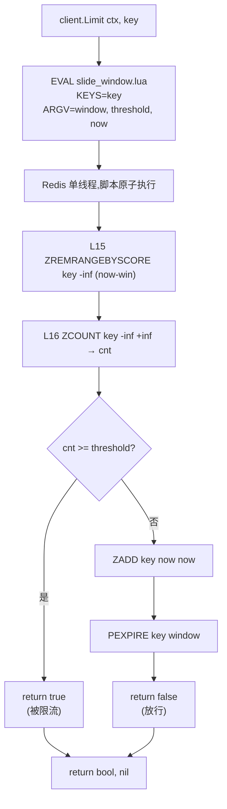

# 华师匣子限流中间件

> **适用版本**：`github.com/redis/go-redis/v9`  
> **适用模块**：`common/pkg/limiter`  
> **相关笔记**：[[华师匣子]] · [[华师匣子框架]] · [[go-kratos 中间件实现]] · [[华师匣子日志封装]] · [[Redis]] · [[压测]] · [[限流服务降级策略]] · [[整体代理(proxy)使用]]

## 目录

1. [目录结构](#1-目录结构)
2. [文件逐个拆解](#2-文件逐个拆解)
   - 2.1 [`types.go` — 抽象接口](#21-typesgo--抽象接口)
   - 2.2 [`redis_slide_window.go` — Redis 滑动窗口实现](#22-redis_slide_windowgo--redis-滑动窗口实现)
   - 2.3 [`slide_window.lua` — 限流核心算法](#23-slide_windowlua--限流核心算法)
3. [潜在问题](#3-潜在问题)
4. [使用示例](#4-使用示例)
5. [调用方现状](#5-调用方现状)
6. [总结与建议](#6-总结与建议)

## 1. 目录结构

```text
common/pkg/limiter/
├── types.go                  # 抽象接口
├── redis_slide_window.go     # 基于 Redis ZSET 的滑动窗口实现
├── slide_window.lua          # 嵌入的 Lua 脚本（用 //go:embed）
└── mocks/
    └── limiter.mock.go       # gomock 生成的 mock
```

## 2. 文件逐个拆解

### 2.1 `types.go` — 抽象接口

```go
// types.go:5
type Limiter interface {
    Limit(ctx context.Context, key string) (bool, error)
}
```

只暴露一个方法，语义：

| 返回值 | 含义 |
|--------|------|
| `(true, nil)` | ==触发限流==（请求被拒绝） |
| `(false, nil)` | 放行（请求被允许） |

> [!warning] 命名反直觉
> `Limit()` 返回 `true` 表示"被限了"，`false` 表示"通过"。命名与一般 boolean（成功/允许）相反，调用方必须明确。

### 2.2 `redis_slide_window.go` — Redis 滑动窗口实现

#### 2.2.1 嵌入脚本 `redis_slide_window.go:11-12`

```go
//go:embed slide_window.lua
var luaScript string
```

`//go:embed` 在编译时把 `slide_window.lua` 内容注入到 `luaScript` 字符串里，部署时无需额外管理 `.lua` 文件。

#### 2.2.2 结构体 `redis_slide_window.go:14-18`

```go
type RedisSlideWindowLimiter struct {
    cmd        redis.Cmdable
    interval   time.Duration
    thresholds int
}
```

字段说明：

| 字段 | 类型 | 作用 |
|------|------|------|
| `cmd` | `redis.Cmdable` | 任意 go-redis 客户端（支持 Standalone/Cluster/Sentinel） |
| `interval` | `time.Duration` | 窗口大小（如 `1s`） |
| `thresholds` | `int` | 窗口内最大允许请求数 |

#### 2.2.3 构造器 `redis_slide_window.go:20-26`

```go
func NewRedisSlideWindowLimiter(cmd redis.Cmdable, interval time.Duration, thresholds int) Limiter {
    return &RedisSlideWindowLimiter{
        cmd:        cmd,
        interval:   interval,
        thresholds: thresholds,
    }
}
```

#### 2.2.4 核心方法 `redis_slide_window.go:28-30`

```go
func (r *RedisSlideWindowLimiter) Limit(ctx context.Context, key string) (bool, error) {
    return r.cmd.Eval(ctx, luaScript, []string{key},
        r.interval.Milliseconds(), r.thresholds, time.Now().UnixMilli()).Bool()
}
```

每次调用都走 `EVAL` 把脚本发给 Redis，传入：

- `KEYS[1]` = `key`（Redis ZSET 的名字，如 `"login:user:42"`）
- `ARGV[1]` = `interval.Milliseconds()`（窗口宽度，毫秒）
- `ARGV[2]` = `thresholds`（阈值）
- `ARGV[3]` = `time.Now().UnixMilli()`（当前时间戳，毫秒）

返回 `bool`：

- `true` → `cnt >= threshold`，被限流
- `false` → 已放行并写入 ZSET

> [!note] 关于 `Eval` vs `EvalSha`
> 当前实现每次都走 `EVAL`（发送完整脚本）。生产高 QPS 场景应改用 `redis.NewScript(...)` 以走 `EVALSHA` 缓存。详见 [§3 问题 2](#问题-2中危eval-每次都发完整脚本未用-scriptevalsha)。

### 2.3 `slide_window.lua` — 限流核心算法

完整脚本（`common/pkg/limiter/slide_window.lua`）：

```lua
-- 1, 2, 3, 4, 5, 6, 7 这是你的元素
-- ZREMRANGEBYSCORE key1 0 6
-- 7 执行完之后

-- 限流对象
local key = KEYS[1]                                    -- L6
-- 窗口大小
local window = tonumber(ARGV[1])                       -- L8
-- 阈值
local threshold = tonumber(ARGV[2])                    -- L10
local now = tonumber(ARGV[3])                          -- L11
-- 窗口的起始时间
local min = now - window                               -- L13

redis.call('ZREMRANGEBYSCORE', key, '-inf', min)                       -- L15
local cnt = redis.call('ZCOUNT', key, '-inf', '+inf')                  -- L16
-- local cnt = redis.call('ZCOUNT', key, min, '+inf')                 -- L17 (注释掉的等价写法)
if cnt >= threshold then                                              -- L18
    -- 执行限流
    return "true"                                                     -- L20
else
    -- 把 score 和 member 都设置成 now
    redis.call('ZADD', key, now, now)                                 -- L23
    redis.call('PEXPIRE', key, window)                                -- L24
    return "false"                                                    -- L25
end
```

#### 2.3.1 数据结构选择 —— Redis ZSET

为什么用 ZSET（有序集合）而不是普通 SET 或 List？

| 数据结构 | 是否合适 | 原因 |
|----------|----------|------|
| `SET` | 否 | 无序，无法按时间范围裁剪 |
| `LIST` | 弱 | 可用 `LPUSH` + `LTRIM` 实现，但按时间范围裁剪需要遍历 |
| `ZSET` | 是 | 天然按 score 排序，`ZREMRANGEBYSCORE` 按分数范围 O(log N + M) 删除，`ZCOUNT` O(log N) 计数 |

每个请求作为一个 member 加入 ZSET，**score = 该请求的时间戳（毫秒）**，后续按时间范围裁剪时直接利用 score 的有序性。ZSET 的更多用法参见 [[Redis]]。

#### 2.3.2 Lua 脚本逐行解读

**参数解析 `slide_window.lua:6-13`**

```lua
local key = KEYS[1]                  -- 限流 key（每个被限对象一个 ZSET）
local window = tonumber(ARGV[1])     -- 窗口宽度（ms）
local threshold = tonumber(ARGV[2])  -- 窗口内允许的最大请求数
local now = tonumber(ARGV[3])        -- 当前时间戳（ms）
local min = now - window             -- 窗口起点
```

`tonumber` 把字符串转数字，`KEYS` 和 `ARGV` 在 Lua 中都是字符串。

**清理过期记录 `slide_window.lua:15`**

```lua
redis.call('ZREMRANGEBYSCORE', key, '-inf', min)
```

删除所有 **score ≤ (now − window)** 的 member，即"已经滑出窗口"的旧请求。`-inf` 表示负无穷，`min` 是窗口起点。

`slide_window.lua:1-3` 的注释解释了这个过程：

```text
1, 2, 3, 4, 5, 6, 7 这是你的元素（按 score 排序）
ZREMRANGEBYSCORE key1 0 6
执行完之后只剩 7
```

**统计当前窗口内请求数 `slide_window.lua:16`**

```lua
local cnt = redis.call('ZCOUNT', key, '-inf', '+inf')
```

数 ZSET 里还剩多少 member，就是"当前窗口内已经请求过几次"。

> [!note] 关于 `ZCOUNT` 范围
> `slide_window.lua:17` 注释了一个更"严格"的替代方案：
> ```lua
> local cnt = redis.call('ZCOUNT', key, min, '+inf')
> ```
> 也就是只统计 `[min, +∞)` 范围内的请求，理论上更精确。但 `slide_window.lua:15` 已经把所有 `< min` 的清掉了，两者结果实际等价；`slide_window.lua:17` 的写法还多读一次边界值。当前实现选的是简单写法。

**触发限流 `slide_window.lua:18-20`**

```lua
if cnt >= threshold then
    return "true"
end
```

如果当前窗口内的请求数 **已经 ≥ 阈值**，直接返回 `"true"` —— 后续 Go 端 `.Bool()` 转成 `true` 表示"被限了"。

> [!tip] 限流不写 ZSET
> 被限流的请求**不会**写入 ZSET，也不会刷新 TTL。这是有意为之 —— 不让"恶意刷请求"在 ZSET 里堆积。

**放行 + 记录 `slide_window.lua:22-25`**

```lua
redis.call('ZADD', key, now, now)       -- 把本次请求作为一条记录写进去
redis.call('PEXPIRE', key, window)      -- 给 key 设置一个 window 毫秒的过期时间
return "false"
```

- `ZADD key score member`：score 和 member 都用 `now`。这样每次请求的 score 就是它的时间戳，后续 `ZREMRANGEBYSCORE` 能按时间范围裁剪。
- `PEXPIRE key window`：给整个 ZSET 设置一个跟窗口等长的 TTL，**防止冷 key 永久残留**（无人访问时自动清理）。

#### 2.3.3 完整流程图



#### 2.3.4 为什么必须用 Lua

把"清理 + 计数 + 写入"三步放在 Lua 里执行的关键原因：

- **Redis 执行 Lua 是原子的**。在 `EVAL` 期间，整个 Redis 单线程都被占用，不会有其他客户端插入。
- 如果用三步走的 pipeline（不是 Lua），在 `ZCOUNT` 和 `ZADD` 之间另一个客户端可能已经 `ZADD` 了，导致并发漏判或超判。
- 所以**滑动窗口算法必须配合 Lua 或 MULTI/EXEC 事务**才能保证正确性。

#### 2.3.5 时间示例

假设 `interval = 1s`，`threshold = 3`：

```text
时刻 t=1000ms, key ZSET 当前内容（按 score 排序）：
  ┌──────────────────────┐
  │ score: 100, 500, 800 │  (三次历史请求)
  └──────────────────────┘

第 4 次请求，t=1100ms：
  L13: min = 1100 - 1000 = 100
  L15: ZREMRANGEBYSCORE -inf 100  → 删掉 score=100 的（0 个）
  L16: ZCNT = 3
  L18: 3 >= 3 → return "true"   ← 触发限流

第 5 次请求，t=1500ms：
  L13: min = 1500 - 1000 = 500
  L15: ZREMRANGEBYSCORE -inf 500  → 删掉 score=500 的
  L16: ZCNT = 2 (只剩 800, 1100)
  L18: 2 < 3 → ZADD 1500 1500, PEXPIRE 1000, return "false"
```

可以看到 **"窗口"是动态滑动的**，而不是固定时间段 —— 这就是"滑动窗口限流"比"固定窗口限流"更精确的原因（固定窗口在窗口边界会有 2× 突刺问题）。

## 3. 潜在问题

> 严重度图例：**[高]**（可能 panic / 安全绕过 / 计数错误）· **[中]**（行为异常 / 性能问题）· **[低]**（代码风格 / 可疑）

### 问题 1（高危）：`ZADD` 的 member 用时间戳，在同一毫秒会丢失计数

`slide_window.lua:23`：

```lua
redis.call('ZADD', key, now, now)
```

**Redis ZSET 的 member 是唯一的**。如果两个请求在**同一毫秒**到达（高 QPS 下非常常见），第二个 `ZADD now now` 只会更新 score 而**不会新增 member**，导致 ZSET 实际只有一条记录却对应两次请求，**计数被低估**。

举例：threshold=10，同一毫秒涌入 5 个请求，ZSET 里只有 1 条记录，`ZCOUNT` 返回 1，后续 9 个请求都被放行，实际放行 10 个、超出阈值 1 个。

> [!error] 高危
> 高 QPS 场景下可能让限流失效，影响后端稳定性。

**修复方案**：

```lua
-- 用 score=now, member=now..':'..唯一后缀
-- 后缀可从 INCR 序列或 ARGV 传入的随机数得到
redis.call('ZADD', key, now, now .. ':' .. ARGV[4])
```

或更简单：让 Go 端生成 UUID 传进 ARGV。

### 问题 2（中危）：`Eval` 每次都发完整脚本，未用 `Script`/`EVALSHA`

`redis_slide_window.go:29`：

```go
return r.cmd.Eval(ctx, luaScript, []string{key}, ...).Bool()
```

每次调用都把整个 Lua 源码发到 Redis，在高 QPS 下浪费带宽。go-redis 提供了 `redis.NewScript(...)`，内部自动走 `EVALSHA` 缓存 + `EVAL` 降级：

```go
var slideWindowScript = redis.NewScript(luaScript)
// 每次调用：
slideWindowScript.Run(ctx, cmd, []string{key}, interval, thresholds, now).Bool()
```

### 问题 3（中危）：返回值方向反直觉

`Limit()` 返回 `true` 表示"被限流"，与一般 boolean（成功/允许）相反。`mocks/limiter.mock.go:43-49` 的注释也没有强调这一点，容易让调用方写反：

```go
// 容易写错
if limited, _ := l.Limit(ctx, key); limited {
    return ErrTooManyRequests
}
```

> [!tip] 建议
> 把方法重命名为 `Allow() (allowed bool, err error)`，或者返回 `(allowed bool, err error)` 并明确文档。

### 问题 4（中危）：限流路径不续期 PEXPIRE

`slide_window.lua:24` 只在放行路径上 `PEXPIRE`，被限流的请求不会刷新 TTL。

**潜在影响**：

- 如果大量请求连续被限流，且 ZSET 里一直有 ≤ threshold 条记录，PEXPIRE 由最后一次放行决定。
- 一段时间后（超过 window），PEXPIRE 触发，key 整体过期，下次请求 `cnt=0` 放行 —— 符合预期。
- 但如果 Redis 内存吃紧，被限流的请求至少做了 `ZREMRANGEBYSCORE` 一次，会延缓 key 过期（没显式 PEXPIRE 不会延缓，但 ZREMRANGEBYSCORE 本身是惰性的）。
- 严格说没问题，但有歧义。

**建议**：在被限流路径也 `PEXPIRE key window`，保持 key 存活，避免下个请求看到空 ZSET 而误判。

### 问题 5（低）：单元测试缺失

`common/pkg/limiter/` 下没有任何 `_test.go`，仅生成了 mock（`mocks/limiter.mock.go:1`）。

- Lua 脚本的语义只靠人工推导，**没有**针对边界条件（空 ZSET、刚过期、并发）的测试。
- 同毫秒计数丢失、时钟回拨、threshold=0 等情况都未覆盖。
### 问题 6（低）：`time.Now()` 在 Go 端而非 Redis 端

`redis_slide_window.go:29`：

```go
r.cmd.Eval(ctx, luaScript, []string{key}, r.interval.Milliseconds(), r.thresholds, time.Now().UnixMilli()).Bool()
```

时间戳从 Go 进程取，而非 Redis `TIME` 命令。在多实例部署时，**每台机器的本地时钟可能略有偏差**，导致窗口边界对齐不严格。

**实际影响**：偏差通常在 ms 级别，远小于常见 interval（秒级），可以接受。但如果需要严格单调时钟，可以让 Lua 内部用 `redis.call('TIME')` 取 Redis 服务器时间。

## 4. 使用示例

```go
// 业务方：同一个用户每分钟最多 60 次
lim := limiter.NewRedisSlideWindowLimiter(rdb, time.Minute, 60)

func (s *Service) DoSomething(ctx context.Context, userID string) error {
    allowed, err := lim.Limit(ctx, "user:"+userID)
    if err != nil {
        return err
    }
    if !allowed {  // 注意是"未被限流"才放行
        return ErrRateLimited
    }
    // ... 业务逻辑
}
```

## 5. 调用方现状

> [!note] 当前状态
> 全工程 `grep` 后没有业务模块直接 import `common/pkg/limiter`，目前以工具库形式存在（可能被设计给未来用，或被其他内部模块通过 wire 注入但尚未触发）。`be-classlist/internal/biz/classer.go:600` 等位置的 `limiter.Wait(ctx)` 引用的不是本包，而是 `golang.org/x/sync/semaphore` 的 `Weighted`。

在 [[压测]] 流量回放时可能触发该模块的限流（取决于前置网关是否在用），需关注 `be-proxy` / 网关层是否已有相同语义（参见 [[整体代理(proxy)使用]]）。

## 6. 总结与建议

| 维度 | 评价 |
|------|------|
| 正确性 | Lua 原子执行保证并发安全 |
| 性能 | ZSET 适合中等 QPS，`Eval` 未走 EVALSHA 略有浪费 |
| 精确度 | 滑动窗口比固定窗口精确 |
| 边界 bug | 同毫秒请求被吞计数（需修复） |
| 可测试性 | 无单元测试，仅 mock（建议补） |
| 实际使用 | 全工程 `grep` 没有业务调用方，目前是工具库形式 |

**优先建议**：

1. **修高并发下计数丢失**：`slide_window.lua:23` 把 member 改为 `now..':'..uuid`。
2. **改用 `redis.NewScript`**：`redis_slide_window.go:29` 切到 `Script.Run` 走 `EVALSHA`。
3. **补 Lua 单元测试**：用 miniredis 或真 Redis 验证边界场景。
4. **明确语义**：文档化"返回 true 表示被限流"，或重命名方法。

## 跨主题链接

- [[华师匣子]] — 项目总览
- [[华师匣子框架]] — Wire DI 与服务治理
- [[go-kratos 中间件实现]] — 同模块的"装饰器 + 上下文注入"模式
- [[华师匣子日志封装]] — `common/pkg/logger`（常与限流配合打 warn 日志）
- [[Redis]] — Redis 数据结构与脚本参考
- [[压测]] — 高 QPS 流量回放最容易暴露问题
- [[整体代理(proxy)使用]] — 上游代理层是否已有限流
- [[pitfalls]] — 通用工程陷阱清单
